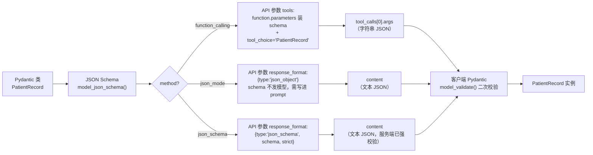
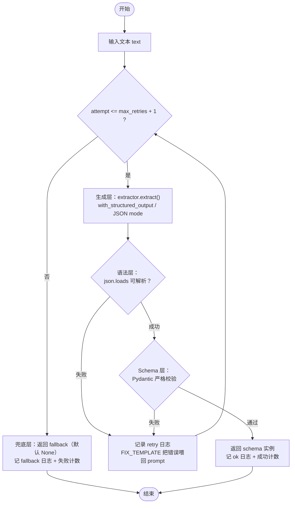

# [AGC:FILE] tool=Cc author=fangkun date=2026-09-09
# LangChain 结构化输出：JSON 保证与企业级可靠性

> 配套可运行代码：`python/src/structured_output/`（离线 `--fake` 演示 + 真实调用）
> 相关旧文：`python/doc/2.结构化输出.md`（`create_agent + response_format` 路径与 qwen 400 错误分析）

## 1. 概述：结构化输出到底在「保证」什么

结构化输出让模型的响应不再是自由文本，而是符合预定义 Schema（Pydantic / TypedDict）的数据。
但它是一个**概率问题**：大模型不是数据库，`json` 不是函数返回值。所谓「保证输出是 JSON」，
在企业实践中必须拆成**三层递进**的保证：

```
┌──────────────────────────────────────────────────────────────┐
│  业务层  枚举取值合法、数值在范围内、必填字段齐全且不为空       │
│          → 由「业务校验规则」兜住，失败→ 重试/修复/回退         │
├──────────────────────────────────────────────────────────────┤
│  Schema 层  字段齐全、类型正确、嵌套结构正确                  │
│          → 由「Pydantic 严格校验」兜住                        │
├──────────────────────────────────────────────────────────────┤
│  语法层  输出是合法 JSON，能被 json.loads 解析                │
│          → 由「with_structured_output / JSON mode / 工具调用」│
│            尽量兜住，但**模型侧只是尽力而为**                  │
└──────────────────────────────────────────────────────────────┘
```

**核心认知**：LangChain 的 `with_structured_output()` 只保证「语法层尽可能接近 JSON」，
真正的**可靠性**来自你自己在 Schema 层和业务层搭的校验 + 重试 + 兜底闭环。这正是本文要讲的「最小可靠闭环」。

本文技术栈（与仓库环境一致）：
- LangChain `1.3.14` / langchain-openai `1.4.1` / pydantic `2.13.4`
- 模型：`deepseek-v4-flash` | `qwen3.6-plus`，均走 OpenAI 兼容接口（`ChatOpenAI` 统一建模）

---

## 2. 策略全景：LangChain 结构化输出的全部路线

### 2.1 全景对照表

| 策略                                                  | 机制                                         | 保证强度                 | 适用模型                                   | 现状                    |
| --------------------------------------------------- | ------------------------------------------ | -------------------- | -------------------------------------- | --------------------- |
| `with_structured_output(method="function_calling")` | 把 schema 伪装成工具，`tool_choice` 强制调用          | 语法层强                 | 支持 tool calling 的模型（deepseek / qwen ✓） | **现代主路径**             |
| `with_structured_output(method="json_mode")`        | 传 `response_format={"type":"json_object"}` | 语法层中（语义级）            | 支持 json mode 的模型                       | **现代主路径**             |
| `with_structured_output(method="json_schema")`      | 传 `response_format={"type":"json_schema"}` | 语法层**最强**（严格 schema） | 仅 OpenAI / Claude / Gemini             | deepseek/qwen **不可用** |
| `PydanticToolsParser` / `JsonOutputToolsParser`     | 直接解析原始 tool_calls 输出                       | 语法层中                 | 同 function_calling                     | 底层组件                  |
| `PydanticOutputParser` / `JsonOutputParser`         | 把指令注入 prompt + 后置解析                        | 语法层弱（纯提示词）           | 任意模型                                   | 仍在 langchain-core     |
| `OutputFixingParser` / `StructuredOutputParser`     | 用 LLM 修复坏 JSON                             | -                    | -                                      | **LangChain 1.x 已移除** |
| `create_agent(..., response_format=...)`            | Agent 内部的 ToolStrategy/ProviderStrategy    | 语法层中                 | 见旧文                                    | Agent 专用路径            |

### 2.2 现代主路径：`with_structured_output()`

LangChain 1.x 中这是**首选 API**，一条调用同时完成「绑定 schema + 强制结构化 + 解析」：

```python
from langchain_openai import ChatOpenAI

llm = ChatOpenAI(model="qwen3.6-plus", base_url=..., api_key=...,
                 extra_body={"enable_thinking": False})   # qwen 必须关 thinking，见 §3

# method="function_calling"：把 schema 包装成工具
# ⚠️ 必须显式传 method：langchain-openai 1.4+ 默认已是 json_schema（见下表警告）
structured = llm.with_structured_output(PatientRecord, method="function_calling")

# include_raw=True：保留原始消息，让调用方自己负责最终严格校验（本文的用法）
structured_raw = llm.with_structured_output(
    PatientRecord, method="function_calling", include_raw=True
)
res = structured_raw.invoke("患者张三，32岁……")
# res = {"raw": AIMessage, "parsed": PatientRecord|None, "parsing_error": BaseException|None}
```

三种 `method` 的区别：

| method | 背后做了什么 | 模型侧行为 | 备注 |
|--------|--------------|-----------|------|
| `function_calling` | schema → tool → `tool_choice` 指定该工具 | 必须输出一次工具调用，JSON 在 `tool_calls[0].args` | 对 deepseek/qwen 最稳，首选 |
| `json_mode` | `response_format=json_object` + prompt 注入 JSON 指令 | 输出一段 JSON 文本 | 语义级，无 schema 强约束；DeepSeek 要求 prompt 含 "json" 字样 |
| `json_schema` | `response_format=json_schema`（严格校验） | 语法上严格符合 schema | **仅 OpenAI/Claude/Gemini**；deepseek/qwen 调用会报错 |

> ⚠️ **版本坑**：langchain-openai 1.4+ 的 `with_structured_output` **不传 `method` 时默认已是
> `json_schema`**（不再是 0.x / 早期 1.x 的 `function_calling`）。deepseek/qwen 不传 method 会
> 直接 400：`response_format.type ... json_schema is not supported by this model`。
> **deepseek/qwen 必须显式传 `method="function_calling"`（最稳）或 `"json_mode"`**，本文所有
> 示例代码均显式传 method。

### 2.3 工具解析器：PydanticToolsParser / JsonOutputToolsParser

当你用裸 `bind_tools()` 而非 `with_structured_output` 时（比如 Agent 内部），需要手动把
模型返回的 `tool_calls` 解析成对象：

```python
from langchain_core.output_parsers import PydanticToolsParser, JsonOutputToolsParser

parser = PydanticToolsParser(tools=[PatientRecord], first_tool_only=True)
obj = parser.invoke(ai_message)          # → PatientRecord
```

它们与 `with_structured_output(method="function_calling")` 内部用的是同一套机制，
只是把「绑定 + 解析」拆开，给调用方更多控制。

### 2.4 旧版 parser 路线：PydanticOutputParser 仍在，修复器已移除

**仍然存在**（langchain-core）——纯提示词路线：把 schema 的 JSON 示例注入 prompt，
模型输出文本后由 parser 解析：

```python
from langchain_core.output_parsers import PydanticOutputParser

parser = PydanticOutputParser(pydantic_object=PatientRecord)
prompt = f"{user_text}\n\n{parser.get_format_instructions()}"   # 指令注入 prompt
obj = parser.parse(llm.invoke(prompt).content)                  # 失败抛 OutputParserException
```

**已被移除**（LangChain 1.x 中不存在，0.x 时代在 `langchain.output_parsers`）：
- `OutputFixingParser`：用 LLM 修坏 JSON 的「修复器」
- `StructuredOutputParser`

> 它们的功能没有消失，而是被 `with_structured_output()` 内化，或由你自研的重试闭环替代
> （见 §4）。**如果你在网上看到 `from langchain.output_parsers import OutputFixingParser`
> 的代码，那属于 0.x，在 1.3.14 里已跑不通。**

### 2.5 Agent 路径：create_agent + response_format

Agent 场景的结构化输出走 `create_agent`，内部有 ProviderStrategy / ToolStrategy 自动选择，
**qwen 系列不在 ProviderStrategy 支持列表中，始终降级 ToolStrategy**。详见旧文
`python/doc/2.结构化输出.md`，本文不重复展开。

### 2.6 机制拆解：JSON 到底是从哪一层来的？

**核心结论**：模型返回 JSON，既不是提示词文本「逼」出来的，也不是 Python 侧「继承了
BaseModel」——**是 Pydantic 类在请求发出前被转成纯 JSON Schema，装进一条独立于 prompt
的 API 参数通道（`tools` / `response_format`），模型原生按 schema 约束输出，客户端再把
JSON 还原成 Pydantic 实例**。`BaseModel` 在链路两端各用一次：前头产出 schema 喂给 API，
后头校验返回结果；中间只有纯 JSON 往返，没有 Python 对象。



三种 method 在这条链路上的全部差异，只看 **schema 装进哪个 API 参数、prompt 是否被改动**：

| method             | 源码位置（langchain-openai 1.4.1） | prompt 文本                 | schema 走的 API 参数                                              | 模型侧行为            | JSON 返回载体            | 保证强度                   |
| ------------------ | ---------------------------- | ------------------------- | ------------------------------------------------------------- | ---------------- | -------------------- | ---------------------- |
| `function_calling` | `chat_models/base.py:2490`   | **零改动**                   | `tools[].function.parameters` + `tool_choice="PatientRecord"` | 强制一次工具调用         | `tool_calls[0].args` | 语法层强（provider 原生工具调用）  |
| `json_mode`        | `chat_models/base.py:2521`   | **零注入，但要求你自己写 schema 描述** | `response_format={"type":"json_object"}`                      | 只保证输出合法 JSON     | `content`            | 语法层中（**不保证符合 schema**） |
| `json_schema`      | `chat_models/base.py:2537`   | **零改动**                   | `response_format={"type":"json_schema",...}`                  | 服务端按 schema 强制输出 | `content`            | 语法层最强（strict 服务端校验）    |

**json_mode 是唯一需要你在提示词里动手的**：`with_structured_output` 根本不会把 schema
传给模型，源码注释原话 *"you must include instructions for formatting the output into the
desired schema into the model call"*。模型此时只被 API 要求「输出合法 JSON」，不知道
`PatientRecord` 长什么样。若要使用，把 `PydanticOutputParser(pydantic_object=schema)
.get_format_instructions()` 的产物拼进提示词（§2.4 的老路线就是干这个的）。

以本仓库 `PatientRecord` 为例，`function_calling` 实际发给 API 的请求体（节选）：

```json
{
  "messages": [{"role": "user", "content": "患者张三，32岁……"}],
  "tools": [{
    "type": "function",
    "function": {
      "name": "PatientRecord",
      "description": "自由文本 -> 结构化病历抽取的演示 Schema。",
      "parameters": {
        "type": "object",
        "additionalProperties": false,
        "required": ["name", "age", "symptoms", "risk_level"],
        "properties": {
          "name": {"type": "string"},
          "age": {"type": "integer"},
          "symptoms": {"type": "array", "items": {"type": "string"}},
          "risk_level": {"type": "string", "enum": ["low", "medium", "high"]},
          "contact": {
            "anyOf": [
              {"type": "object", "properties": {
                "email": {"anyOf": [{"type": "string"}, {"type": "null"}], "default": null},
                "phone": {"anyOf": [{"type": "string"}, {"type": "null"}], "default": null}},
               "additionalProperties": false, "title": "ContactInfo"},
              {"type": "null"}
            ],
            "default": null
          }
        }
      }
    }
  }],
  "tool_choice": "PatientRecord",
  "parallel_tool_calls": false
}
```

返回的 `AIMessage` 里 JSON 在 `tool_calls[0].function.arguments`（字符串）；
`PydanticToolsParser` 先 `json.loads` 再 `PatientRecord.model_validate(...)` 还原成实例。
**提示词文本从头到尾没有被拼接任何内容。**

**模型到底看到了什么？（关键澄清）** 「提示词零改动」不等于「模型没看到 schema」。发给 API
的请求体是顶层一整包字段——`messages` 只是其中之一，`tools` / `tool_choice` 与它**平级**：

```json
{
  "model": "deepseek-v4-flash",
  "messages": [{"role": "user", "content": "患者张三，32岁……"}],
  "tools": [{"type": "function", "function": {
      "name": "PatientRecord", "description": "...", "parameters": { ...schema... }}}],
  "tool_choice": {"type": "function", "function": {"name": "PatientRecord"}},
  "parallel_tool_calls": false
}
```

推理服务会把 `tools` 里每个函数的 name / description / parameters **转成特殊工具令牌，追加进
模型的输入上下文**（与 messages 一起）。所以模型**确实读到了** `PatientRecord` 的全部字段——
类型、`required` 列表、`enum`——只是它不在你写的聊天文本里，而是框架经 `tools` 通道替你送的。
「知道要返回 JSON」也不是魔法：工具调用协议的输出格式规定 `function.arguments` 必须是符合该
parameters schema 的 JSON 字符串（模型在训练时内化了这个契约），于是：

```json
tool_calls[0] = {
  "function": {
    "name": "PatientRecord",
    "arguments": "{\"name\":\"张三\",\"age\":32,\"symptoms\":[\"发热\",\"咳嗽\"],\"risk_level\":\"high\"}"
  }
}
```

**「返回 JSON」是协议输出格式的必然结果**，不是模型即兴发挥。但它是**条件概率**：模型仍可能
填错枚举、漏必填字段、把数字输出成字符串（`age: "32"`）——schema 保证的最后防线永远在你自己
的 Pydantic 校验 + 重试兜底（§4）。对照 `json_mode`（不发 `tools`，模型上下文里**没有任何字段
定义**），就明白为什么它必须由你在 prompt 里补 schema。

> 完整 tool spec / JSON Schema 由 `convert_to_openai_tool(PatientRecord)` 生成，可直接在
> 代码里打印验证（`python/src/structured_output/` 的 schema 与 §2.6 此表对应）。

---

## 3. 模型能力对照：deepseek-v4-flash vs qwen3.6-plus

两张图先给结论：**你实际用的两个模型都无法使用 `json_schema` 严格模式**，
所以「保证」必须落在自己的校验层（§4），而不是指望模型原生能力。

| 能力                       | deepseek-v4-flash                                             | qwen3.6-plus                                        | 备注                                           |
| ------------------------ | ------------------------------------------------------------- | --------------------------------------------------- | -------------------------------------------- |
| OpenAI 兼容接口              | ✓                                                             | ✓                                                   | `ChatOpenAI` 统一建模                            |
| function calling         | ✓                                                             | ✓                                                   | 结构化输出的首选方式                                   |
| JSON mode（`json_object`） | ✓                                                             | ✓                                                   | 语义级，非 schema 强约束                             |
| 严格 json_schema           | ✗                                                             | ✗                                                   | 仅 OpenAI/Claude/Gemini；qwen 严格模式要到 3.7+ 系列才有 |
| **严格 schema 的可选路径**      | `strict:true` 工具调用（Beta）                                      | 无                                                   | deepseek 可用 `/beta` base_url 启用，服务端校验 schema |
| thinking 模式              | **默认开启**，CoT 在 `reasoning_content` 字段，**不污染** content 里的 JSON | **默认开启**，限制 `tool_choice`，json_object 下可能输出非严格 JSON | 见 §3.1                                       |
| json_object 触发条件         | prompt 需含 "json" 字样，否则可能输出空白流                                 | prompt 需含 "JSON" 字样，否则 API 报错                       | 见 §3.3                                       |

### 3.1 qwen 的 thinking 坑：结构化输出 400 错误

旧文已完整分析：qwen3.5-plus（qwen3.6-plus 同族）**默认开启 thinking**，thinking 模式下
DashScope API **只允许 `tool_choice="auto"`**，而 ToolStrategy / `with_structured_output`
强制 `tool_choice="any"` 或指定具体工具 → 触发 400：

```
openai.BadRequestError: ... The tool_choice parameter does not support
being set to required or object in thinking mode
```

**解法：显式关闭 thinking**：

```python
llm = ChatOpenAI(..., extra_body={"enable_thinking": False})
```

> ⚠️ `config.py` 的 qwen provider 已默认带上这个配置。若你换用支持 ProviderStrategy
> 的模型（OpenAI/Claude），则不需要关 thinking。

### 3.2 结论：保证模型侧是「尽力而为」，校验层是「最后防线」

```
模型原生能力（语法层，尽力而为）
   ├─ deepseek : function_calling / json_object
   │             另有 strict:true 工具调用 Beta（/beta）可到 schema 级，见 §6.3
   └─ qwen3.6  : function_calling / json_object     —— 无严格路径，还要关 thinking
            ↓
你自己的 Pydantic 严格校验（schema 层，硬保证）   ← 两个模型通用的最后防线
   ↓ 失败
带错误反馈的重试 + 兜底 + 观测（§4）
```

### 3.3 JSON mode 的两个通用坑

| 坑 | 现象 | 解法 |
|----|------|------|
| prompt 缺 "JSON" 字样 | deepseek 输出空白流；qwen 直接 API 报错 | json_mode 内部指令通常已含 "JSON"；手写 prompt 时自查 |
| 设置了 `max_tokens` | 输出被截断 → 坏 JSON | 结构化输出**默认不设 max_tokens**（`config.py` 已如此）；确要设则给高值 |

---

## 4. 最小可靠闭环（核心设计）

### 4.1 架构

配套代码：`python/src/structured_output/pipeline.py`

> **想先看全貌？** 单文件教学版 `python/src/structured_output/simple_onefile.py` 把
> ①②③④⑤ 五层保证平铺在一个文件里、逻辑等价、注释最细（含逐行"为什么"），
> 建议先通读它，再回来抠多文件的抽象。



> 观测贯穿全程：`JsonlLogger`（JSONL 逐条日志）与 `FailureCounter`（失败率计数）挂在
> `R` / `FB` / `OK` 三个分支上，无额外依赖。

### 4.2 关键决策与理由

**① 用 `include_raw=True`，校验权握在自己手里**
`with_structured_output` 默认自己解析并返回实例；一旦失败你只能拿到一个异常，看不到原始输出。
`include_raw=True` 返回 `{"raw", "parsed", "parsing_error"}`，`RealExtractor` 从 `raw` 里
提取 JSON 字符串，**由本闭环做最终严格校验**——保证强度不受模型侧解析行为影响。

**② strict 只打在类型字段上，str 枚举保留宽松模式（踩坑记录）**
最早版本给 `ConfigDict(strict=True)` 全局严格，结果 str 枚举 `RiskLevel` 连 `"high"` 这种
合法值都拒绝了（Pydantic 要求 `RiskLevel` 实例而非其字符串值）。修正为：

```python
model_config = ConfigDict(extra="forbid")        # 多余字段判失败
name: str = Field(strict=True)                   # 类型转换只打在关键字段
age: int = Field(strict=True)
risk_level: RiskLevel                            # 宽松模式：接受 "high"，拒绝 "SEVERE"
```

**③ 重试次数与兜底都可配置，默认「None + 日志 + 计数」**
```python
pipeline = StructuredOutputPipeline(
    extractor, PatientRecord,
    max_retries=2,          # 1 次 + 2 次带错误反馈的自修复
    fallback=None,          # 兜底实例；默认 None
    logger=JsonlLogger(), counter=FailureCounter(),
)
```

**④ 自研重试替代已移除的 OutputFixingParser**
修复器把「校验错误喂回 prompt 让模型自纠正」——这正是闭环里 `FIX_TEMPLATE` 做的事，
但你可以完全掌控重试次数、错误内容、日志与兜底，比黑盒修复器更适合生产观测。

### 4.3 运行结果（离线 `--fake` 演示，无需 API key）

```
python -m src.structured_output.demo --self-check
```

四条脚本化路径，对应四种现实失败形态：

| 假模型模式 | 模拟的失败形态 | 闭环行为 | 结果 |
|-----------|---------------|---------|------|
| `good` | 模型正常 | 1 次成功 | `ok, attempts=1` |
| `retry_once` | 缺必填字段 + 类型错 + 枚举非法 | 第 1 次失败 → 错误喂回 → 第 2 次成功 | `ok, attempts=2` |
| `hopeless` | 永远输出坏 JSON | 重试 2 次仍失败 → 兜底 | `fallback, attempts=3, None` |
| `nojson` | 返回纯文本（无 JSON） | 语法层失败 → 重试 → 兜底 | `fallback, None` |

`retry_once` 的真实输出节选：

```
=== 完整病历 ===
status=ok  attempts=2  latency=1ms
  [err] ValidationError: 3 validation errors for PatientRecord
name
  Field required [type=missing, ...]
age
  Input should be a valid integer [type=int_type, input_value='32', input_type=str]
  ...
结果: {'name': '张三', 'age': 32, 'symptoms': ['发热', '咳嗽'],
      'risk_level': <RiskLevel.HIGH: 'high'>, 'contact': {'phone': '13800000000'}}
```

`age='32'`（字符串）被 `Field(strict=True)` 拦下——这正是「schema 级保证」的直观体现。

### 4.4 真实调用

```
python -m src.structured_output.demo --provider qwen --method function_calling
python -m src.structured_output.demo --provider deepseek --method json_mode
```

环境变量沿用仓库惯例：`OPENAI_BASE_URL / OPENAI_MODEL / OPENAI_API_KEY`，
provider 只决定 `extra_body` 与默认值（qwen 默认关 thinking）。

### 4.5 生成层：谁在什么时候被调用

生成层是闭环里唯一的「外部世界」入口——它把 prompt 变成 `RawResult`（一段可解析的 JSON
或失败说明）。`StructuredOutputPipeline` 对 `RealExtractor` 和 `FakeExtractor` 一视同仁，
只认下面这个接口：

```python
@dataclass
class RawResult:
    json_str: str | None              # 可解析的 JSON 字符串；None 表示生成层没有产出 JSON
    note: str = ""                    # 失败时的原因说明
    raw_message: dict | None = None   # 模型原始响应序列化（AIMessage.model_dump()），供日志观测

# 统一接口：输入 prompt，输出规范化 JSON
def extract(text: str) -> RawResult: ...
```

**调用时序**：pipeline 每次尝试（attempt）恰好调用一次 extractor，共 `max_retries + 1`
次封顶：

| 时序 | 传入的 prompt | 说明 |
|------|--------------|------|
| attempt=1 | 原始业务文本 `text` | 第一次生成 |
| attempt=2 | `text + FIX_TEMPLATE.format(error=第一次错误)` | 重试：把上次校验错误喂回 |
| attempt=N（N≥2） | `text + FIX_TEMPLATE.format(error=上一次错误)` | 最多 `max_retries + 1` 次 |
| 全部失败 | —— | 进入兜底层（§4.1 的 `FB` 节点） |

**选择 Real 还是 Fake（实例化决策）**：

| 场景 | 用哪个 | 理由 |
|------|--------|------|
| 本地开发 / 教学 / 演示 | `FakeExtractor` | 免费、确定，四剧本覆盖成功/自修复/兜底/无 JSON 全部分支 |
| 单元测试 / CI | `FakeExtractor`（或定制 mock） | 结果确定，不因网络/模型波动 flaky，不花 token |
| 真实业务 / 上线 | `RealExtractor` | 真调模型，把真实输出接进校验→重试→兜底→观测闭环 |
| 上线前冒烟 | 先 `Fake` 后 `Real` | 逻辑先跑绿，再验模型侧行为（thinking 开关、枚举取值等） |

**切换的落地点**：实例化发生在**调用方**（`demo.py` 的 `--fake` / `--self-check` /
`--provider` 分支），pipeline 内部零改动。生产 / 测试切换 = 换构造函数的实参：

```python
extractor = (
    FakeExtractor("retry_once")                     # 离线：四剧本之一
    if args.fake
    else RealExtractor(llm, PatientRecord, method)  # 真实：with_structured_output
)
pipeline = StructuredOutputPipeline(extractor, PatientRecord, ...)
```

> 对应 §4.1 流程图里的 `G`（生成层）节点：它每次循环被 `invoke` 一次，喂的 prompt 随重试
> 变化，其余逻辑全部由 pipeline 承担。

---

## 5. 观测：让失败可见

### 5.1 零依赖基线：JSONL + 失败率计数器

`python/src/structured_output/observability.py`，纯标准库，**不需要 LangSmith key 也能常开**。
每次调用写一条 JSONL：

```json
{"ts": "2026-09-09T14:01:50+0800", "request_id": "bfc4573d9bc0", "status": "retry",
 "attempt": 1, "max_retries": 2,
 "error": "ValueError: content 中未找到 JSON 对象",
 "prompt": "一个发烧的病人。",
 "raw_json": null,
 "raw_message": {"content": "收到。不过当前描述「一个发烧的病人」信息比较简略……"},
 "parsed": null,
 "provider": "deepseek", "model": "deepseek-v4-flash", "method": "function_calling"}
```

每条记录含完整调用轨迹：**`prompt`**（本次喂给模型的完整提示词，重试时已带上错误反馈）、
**`raw_json`**（生成层提取的可解析 JSON 原文，失败分支为 null）、**`raw_message`**
（`AIMessage.model_dump()` 的完整序列化：tool_calls / response_metadata / usage_metadata /
additional_kwargs，仅真实调用填充，fake 为 null）、**`parsed`**（`obj.model_dump()` 的解析
结果，失败分支为 null）、**`error`**（失败原因，成功为 ""）。上面的 `retry` 记录来自一次
真实 deepseek 调用——模型没吐 JSON 而是回了自然语言澄清，语法层把它拦下并触发重试；
`ok` 记录的差异仅在于 `raw_json` / `parsed` 有值、`error` 为空。

进程内 `FailureCounter` 汇总：`total / ok / failed / retries_used / success_rate_%`。
企业落地时把 `error` 字段按类型聚合（`ValidationError` vs `JSONDecodeError` vs 超时），
就能回答三个关键问题：**哪类失败最多？重试救回了多少？兜底率是否在恶化？**

### 5.2 LangSmith：可选增强层

`simpe.env.example` 里 `LANGSMITH_TRACING=true` 已就位，填入 `LANGSMITH_API_KEY` 即可。
LangSmith 提供全链路 trace（prompt / 原始输出 / token 用量）与在线评测，与本地 JSONL
**互补不冲突**：本地 JSONL 是零依赖的兜底基线，LangSmith 是富上下文的上层。

### 5.3 告警思路

对 `success_rate_%` 设阈值（如 < 98%）触发告警；对 `retries_used / total`（平均重试率）
超阈值告警——**重试率升高通常是 schema 定义与模型能力不匹配的前兆**（如枚举太死、必填字段太严）。

---

## 6. 企业级进阶

### 6.1 离线评测（golden set 打分）

上线前用固定语料集回归。对每条样本记录：是否通过严格校验、重试次数、兜底与否、
字段级 F1（抽取对 / 抽多 / 抽漏）。**结论落成两个数字：schema 命中率 + 平均重试成本**，
并据此调整 schema 的宽松度（枚举、strict 字段、必填项）。

### 6.2 成本控制

| 项 | 测算 | 控制手段 |
|----|------|---------|
| 重试预算 | 每次失败重试 = 一次完整 prompt 往返 | `max_retries` 设上限（本文默认 2），重试 prompt 只追加错误不重复全文 |
| token 记账 | 记录每次调用的 input/output tokens | JSONL 记录 token 用量；对 token 超限样本告警 |
| 升级降级 | 重试时可切更强模型（配置项，默认关） | 只在重试全失败后触发，且限定一次 |

### 6.3 更强的 schema 保证（可选）

若业务要求「模型侧就做 schema 强校验」（减少自研重试频率），DeepSeek 提供
**`strict:true` 工具调用 Beta**：`base_url="https://api.deepseek.com/beta"`，所有工具必须
`strict:true`，服务端校验参数 schema。它把校验前移到 API 层，但仍属 Beta，需评估稳定性。
qwen3.6-plus 没有等价能力（严格模式在 3.7+ 系列才有）。

---

## 7. 故障排查速查表

| 现象                                                           | 原因                                  | 解法                                                      |
| ------------------------------------------------------------ | ----------------------------------- | ------------------------------------------------------- |
| qwen 结构化输出报 400 `tool_choice ... thinking mode`              | thinking 模式限制 tool_choice           | `extra_body={"enable_thinking": False}`（§3.1）           |
| `with_structured_output` 不传 `method` 报 400 `json_schema is not supported` | langchain-openai 1.4+ 默认 method 已是 `json_schema` | **显式传 `method="function_calling"`**（或 `json_mode`），见 §2.2 警告 |
| `with_structured_output(method="json_schema")` 报错            | deepseek/qwen 不支持 strict schema     | 改用 `function_calling` 或 `json_mode`                     |
| DeepSeek json_mode 输出空白流                                     | json_object 模式要求 prompt 含 "json" 字样 | prompt 加 JSON 字样；或改 function_calling                    |
| qwen json_object 直接报错                                        | prompt 缺 "JSON" 字样                  | json_mode 内部指令通常已含；手写 prompt 自查                         |
| 结构化输出截断成坏 JSON                                               | 设置了过低的 `max_tokens`                 | 不设 max_tokens 或给高值（config.py 默认不传）                      |
| deepseek tool-call 回合 content 为空                             | thinking 模式下工具回合 content 可为空        | `extractors.py` 已做 content 兜底；多轮需回传 `reasoning_content` |
| 输出带 ```json 围栏                                               | 模型按 Markdown 输出                     | `_strip_json()` 已处理围栏与前导文本                              |
| `age` 类型总是报错                                                 | strict 字段                           | 检查模型是否把数字输出成字符串，重试可救                                    |
| `from langchain.output_parsers import OutputFixingParser` 报错 | 1.x 已移除                             | 用本文 §4 自研重试闭环                                           |

---

## 8. 参考

- 代码：`python/src/structured_output/`（`pipeline.py` 为闭环核心）
- 单文件教学版：`python/src/structured_output/simple_onefile.py`（五层闭环平铺、注释最细，建议先读）
- LangChain OSS Python 结构化输出文档：https://docs.langchain.com/oss/python/langchain/structured_output
- DeepSeek API：https://api-docs.deepseek.com/api/create-chat-completion
- DeepSeek 工具调用（strict:true Beta）：https://api-docs.deepseek.com/guides/tool_calls
- DeepSeek JSON mode：https://api-docs.deepseek.com/guides/json_mode
- DeepSeek thinking mode：https://api-docs.deepseek.com/guides/thinking_mode
- 阿里云 Model Studio JSON mode：https://www.alibabacloud.com/help/en/model-studio/json-mode
- 阿里云 OpenAI 兼容说明：https://www.alibabacloud.com/help/en/model-studio/compatibility-of-openai-with-dashscope
- 旧文（create_agent 路径 + qwen 400 分析）：`python/doc/2.结构化输出.md`
