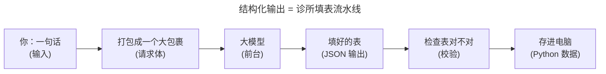
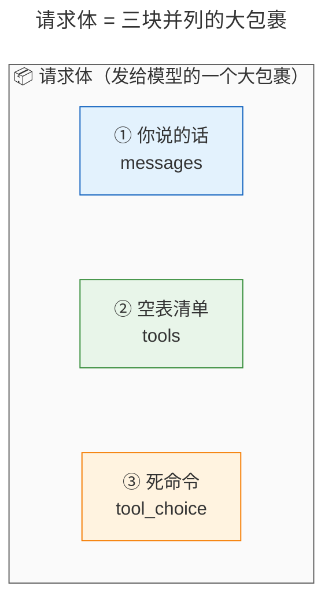
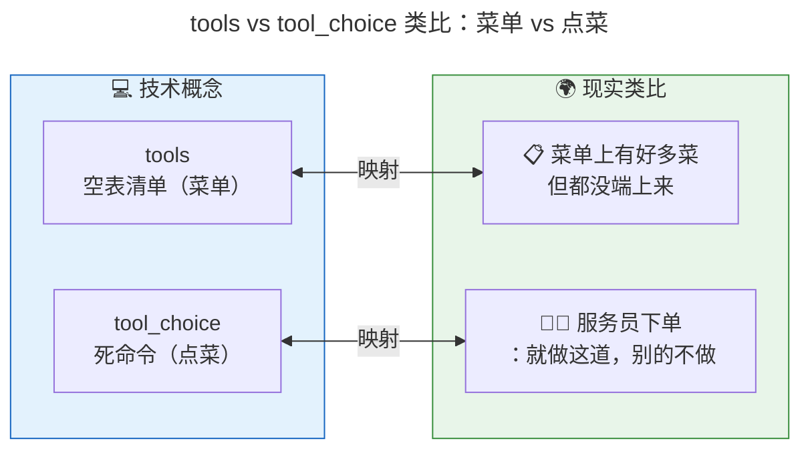
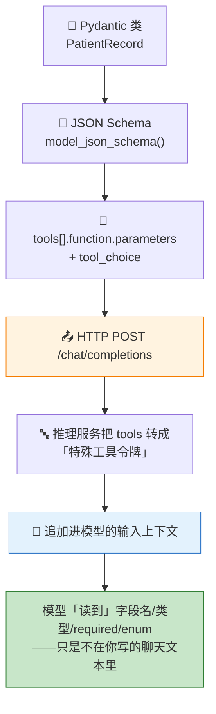
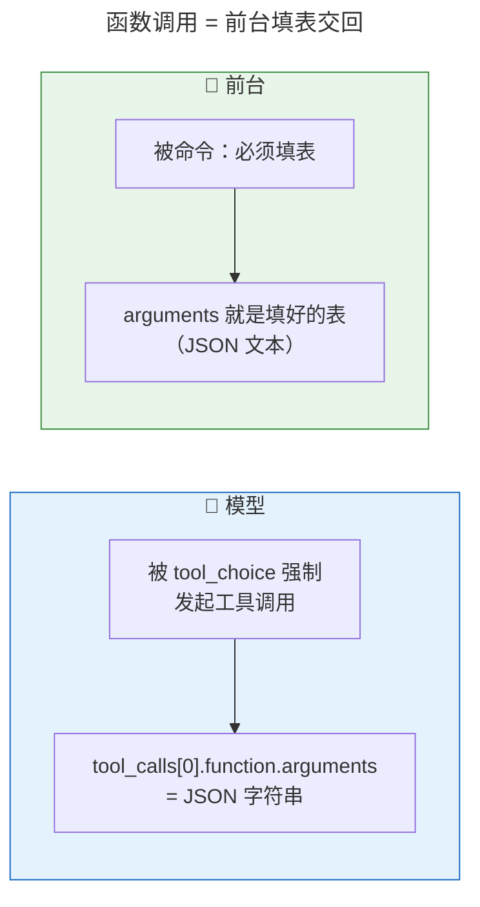
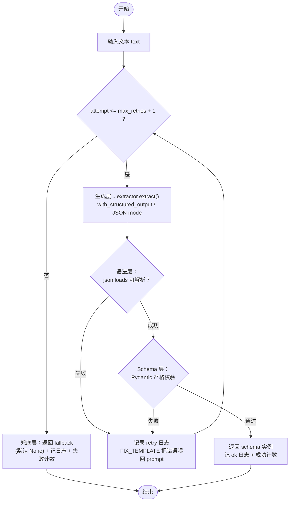
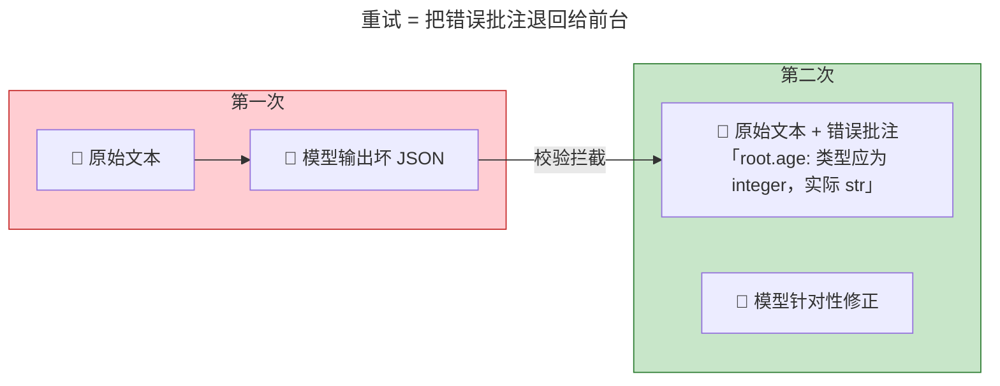
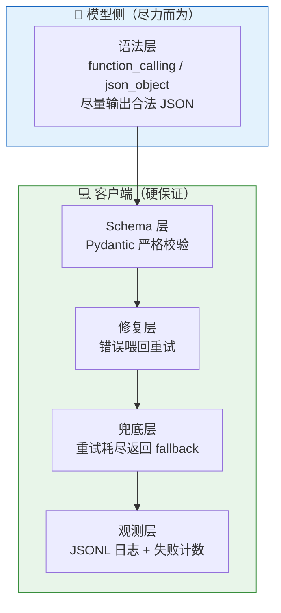

# [AGC:FILE] tool=Cc author=fangkun date=2026-09-09
# LangChain 结构化输出原理 - 大白话版

> 本文只讲一件事：**大模型是怎么"被迫"返回符合要求的数据的**。
> 配套代码：[python/src/structured_output](https://github.com/kunge2013/LangChainBestPractices/tree/main/python/src/structured_output)（每个代码块都能在对应文件里找到原样版本）。

---

## 一、一句话说明白

**结构化输出 = 让大模型把你说的话，填进一张"规定好的表"里交回来。**

平时的大模型像一个"随口聊天的朋友"，你问什么它自由回答；
开了结构化输出，它像一个"必须按表格填的前台"，说的话被硬塞进固定格式，方便电脑读取。

**三个关键词先记住，全文围绕它们展开：**

| 关键词 | 大白话 | 通俗比喻 |
|---|---|---|
| **提示词（messages / content）** | 你说的话 | 病人的口头描述 |
| **tools** | 规定好的"空表"（表格清单） | 前台桌上印好格子的病历表 |
| **tool_choice** | 命令大模型"必须填这张表"的死命令 | 服务员"就点这道菜，别的不要" |

---

## 二、大白话故事：去诊所看病，要填一张病历表

想象你生病去诊所，整个过程是这样的：

1. **你说话**：告诉前台"我头疼、发烧，两天了"。
2. **前台有一张病历表**：上面印好了格子——姓名、年龄、症状、风险等级（低/中/高）。
3. **前台按规矩填表**：把你的话填进对应格子，不闲聊、不写别的。
4. **填好的表交给你**：一张整整齐齐的病历表。
5. **你检查**：姓名填了吗？年龄是不是数字？有没有填错栏？不对就让她重填。
6. **存进电脑**：这张表以后就能被电脑自动处理。

**"结构化输出"就是这件事**——让大模型（前台）把你说的话，填进一张"规定好的表"里交回来。



接下来一层一层往深挖：**这个大包裹到底是什么？模型凭什么填表？模型为什么返回 JSON？**

---

## 三、第一层：请求体 = 三块并列的大包裹

普通聊天时，发给大模型的包裹里**只有你说的一句话**。
结构化输出时，包裹里**多出两块东西**，和你说的话**并排**放在一起：



**注意"并排"两个字，这是全文最关键的认知：**

- 三块字段是**平级的**，谁也不在谁里面。
- `tools` 和 `tool_choice` 不塞进你说的话里，而是和你说的话**平行**放在请求体顶层。
- 正因为它们平行，才会出现"提示词一个字没改，模型却也看到了表格"。

下面是真实发给模型的请求体（节选），请盯着 `messages`、`tools`、`tool_choice` 这三块：

```json
{
  "model": "glm-5.2",
  "messages": [
    {"role": "user", "content": "患者张三，32岁，因发热咳嗽就诊……"}
  ],
  "temperature": 0.7,
  "max_tokens": 20000,
  "tools": [
    {
      "type": "function",
      "function": {
        "name": "PatientRecord",
        "description": "自由文本 -> 结构化病历抽取的演示 Schema。",
        "parameters": {
          "type": "object",
          "additionalProperties": false,
          "required": ["name", "age", "symptoms", "risk_level"],
          "properties": {
            "name":       {"type": "string"},
            "age":        {"type": "integer"},
            "symptoms":   {"type": "array", "items": {"type": "string"}},
            "risk_level": {"type": "string", "enum": ["low", "medium", "high"]},
            "contact":    {"type": ["object", "null"],
                           "properties": {"email": {"type": ["string", "null"]},
                                          "phone": {"type": ["string", "null"]}}}
          }
        }
      }
    }
  ],
  "tool_choice": {"type": "function", "function": {"name": "PatientRecord"}}
}
```

接下来把这三块一一拆开讲。

---

## 四、拆开第一块：messages = 提示词（你说的话）

**大白话**：`messages` 就是你打给大模型的那句话，里面装着你要处理的信息。

```
患者张三，32岁，因发热咳嗽就诊，症状持续三天，评估为高风险，联系电话13800000000。
```

这句话里有名字、年龄、症状、风险等级、电话——但都"藏在话里"，像一锅粥，电脑没法直接用。
`messages` 里每条消息有 `role`（`user` 是你、`system` 是设定、`assistant` 是模型）和
`content`（内容文本）。

> **关键认知**：在 function_calling 通道下，这句提示词**从头到尾一个字都没被改**。
> 表格（schema）不是拼接在这句话后面的，而是走另一条通道（`tools`）平行送进去的。
> 这就是"提示词零改动"的意思。

**对照一下就明白**：如果是 json_mode 通道，模型看不到表格，你必须把 schema 文本**自己写进**
`system` 消息里。同一个 `messages`，两种命运：

| 通道 | messages 提示词 | 模型知道表格吗？ |
|---|---|---|
| function_calling | 零改动 | 知道（走 tools 通道平行送进去） |
| json_mode | 必须手动把 schema 写进 system | 不知道（你没发 tools，只能靠提示词） |

---

## 五、拆开第二块：tools = 空表清单

**大白话**：`tools` 里装的，是你要大模型照着填的"空表"。它告诉大模型：**有这些表格可以用**。
它是一份"菜单/空表清单"。

### 5.1 这张"空表"长什么样

```json
{
  "type": "function",
  "function": {
    "name": "PatientRecord",                  // 表的名字：病历表
    "description": "自由文本 -> 结构化病历抽取", // 这表干嘛用的
    "parameters": {                           // 表上印了哪些格子
      "type": "object",
      "required": ["name", "age", "symptoms", "risk_level"],  // 必须填的格子
      "properties": {
        "name":       {"type": "string"},                 // 姓名：填文字
        "age":        {"type": "integer"},                // 年龄：填数字
        "symptoms":   {"type": "array", "items": {"type": "string"}},  // 症状：一串文字
        "risk_level": {"type": "string", "enum": ["low", "medium", "high"]}, // 只能三选一
        "contact":    {"type": ["object", "null"]}        // 可填可不填
      }
    }
  }
}
```

> 注意"风险等级"那一格写着 `enum: low / medium / high`——意思是**只能从这三个里挑一个**，
> 不许自己发明一个 "SEVERE"。这就是表格在管着大模型。

**一句话记住 `tools`：它就是"菜单/空表清单"，告诉大模型"有这些表可以用"。**

### 5.2 这张"空表"从哪来？Pydantic 类（代码）

这张表不是手写的，而是**从一个 Python 类自动生成的**。代码在 [schemas.py](https://github.com/kunge2013/LangChainBestPractices/blob/main/python/src/structured_output/schemas.py)：

```python
# [AGC:START] tool=Cc author=fangkun
from enum import Enum
from pydantic import BaseModel, ConfigDict, Field

class RiskLevel(str, Enum):
    """枚举字段：模型输出 "SEVERE" 这类非法取值会触发校验失败。"""
    LOW = "low"
    MEDIUM = "medium"
    HIGH = "high"

class ContactInfo(BaseModel):
    """嵌套模型：演示对象嵌套校验。"""
    model_config = ConfigDict(extra="forbid")
    email: str | None = None
    phone: str | None = None

class PatientRecord(BaseModel):
    """自由文本 -> 结构化病历抽取的演示 Schema。"""
    model_config = ConfigDict(extra="forbid")
    name: str = Field(strict=True)
    age: int = Field(strict=True)
    symptoms: list[str]
    risk_level: RiskLevel
    contact: ContactInfo | None = None
# [AGC:END]
```

**逐行翻译成表格**（每个 Python 元素变成什么）：

| Pydantic 元素 | JSON Schema 产物 | 是否发给模型 |
|---|---|---|
| `class PatientRecord` | `function.name = "PatientRecord"` | ✓ |
| 类 docstring | `function.description` | ✓ |
| `ConfigDict(extra="forbid")` | `additionalProperties: false`（多输出字段即非法） | ✓ |
| `name: str` / `age: int` | `"type": "string"` / `"integer"` | ✓ |
| `symptoms: list[str]` | `"type":"array","items":{"type":"string"}` | ✓ |
| `risk_level: RiskLevel` | `"enum": ["low","medium","high"]` | ✓ |
| `contact: ContactInfo \| None = None` | `"anyOf":[...,{"type":"null"}]` | ✓ |
| 必填字段 name/age/symptoms/risk_level | `parameters.required` | ✓ |
| `Field(strict=True)` | **无**——strict 只影响客户端校验 | ✗ |

> 两个容易误会的点：
> 1. **`strict=True` 不会发给模型**。它只影响你自己这边用 `model_validate()` 校验时要不要严格转换
>    类型，是"本地执法"，不是"模型约束"。
> 2. **`extra="forbid"` 会发给模型**。它变成 `additionalProperties: false`，意思是"表格上没有的
>    栏不许填"——模型多输出一个字段都算失败。

---

## 六、拆开第三块：tool_choice = 死命令

**大白话**：光给大模型一张表还不够——它可能偷懒，不交填好的表，反而像聊天一样随便说两句。
所以还要下一条**命令**：**你必须用这张表！**

```json
{
  "type": "function",
  "function": {"name": "PatientRecord"}
}
```

大白话翻译：**"就用这张叫 PatientRecord 的表，别的不许用，也别闲聊，填表！"**



**三块连起来一句话记住：**

| 字段 | 大白话 | 负责什么 |
|---|---|---|
| messages（提示词） | 你说的话 | 提供信息 |
| tools | 空表清单（菜单） | 告诉大模型"要填这张表" |
| tool_choice | 死命令（点菜） | 锁死大模型必须填表，不许闲聊 |

---

## 七、核心原理一：模型为什么"看到"了表格？（tools 通道）

最常见的疑问：**模型知道需要哪些字段，是提示词里写了什么？还是它继承了 Python 的 BaseModel？**
——**两个答案都不对。** 完整链路是这样：



逐句解释：

1. **"继承了 BaseModel" 只是客户端侧的 Python 类型安全**。它让 `model_json_schema()` 能产出
   schema、让 `model_validate()` 能校验结果。它**不会**让模型知道任何东西——模型只知道协议层
   送进去的 token。`BaseModel` 在链路两端各用一次：前头产出 schema 喂给 API，后头校验返回结果；
   中间只有纯 JSON 往返，没有 Python 对象。
2. **"提示词层面处理"也不是主因**。function_calling 通道下，你写的 `messages` 文本**一个字都没变**。
   schema 是走 `tools` 通道**平行**送进去的，所以才有"提示词零改动"。
3. 推理服务收到请求后，会把 `tools` 里每个函数的 name/description/parameters **转成特殊工具令牌，
   追加进模型的输入上下文**（和 messages 一起）。所以模型**确实读到了** `PatientRecord` 的全部字段
   ——只是它不在你写的聊天文本里。

> 反过来说：如果你不发 `tools`（比如 json_mode 通道），模型输入上下文里**没有任何字段定义**，
> 模型根本不知道 `PatientRecord` 长什么样，你必须把 schema 文本**自己写进提示词**。

---

## 八、核心原理二：模型为什么"返回 JSON"？（函数调用协议）

即使模型"看到"了表格，它凭什么输出合法 JSON？答案在**工具调用协议的输出格式**：

1. `tool_choice` 强制模型**必须发起一次对 `PatientRecord` 的工具调用**，不能自由发挥聊天文本。
2. 工具调用协议的输出格式规定：`tool_calls[].function.arguments` **必须是一个符合该函数
   `parameters` schema 的 JSON 字符串**。
3. 模型在训练（指令微调 + 工具调用数据）时**内化了这个契约**。

于是模型返回长这样：

```json
{
  "choices": [{
    "message": {
      "role": "assistant",
      "content": null,
      "tool_calls": [{
        "id": "call_xxx",
        "type": "function",
        "function": {
          "name": "PatientRecord",
          "arguments": "{\"name\":\"张三\",\"age\":32,\"symptoms\":[\"发热\",\"咳嗽\"],\"risk_level\":\"high\"}"
        }
      }]
    }
  }]
}
```

**重点看 `arguments` 这个字段**：它是一整个**字符串**，里面是符合 schema 的 JSON。



**"返回 JSON"是协议输出格式的必然结果**，不是模型即兴发挥。
但这是**条件概率**：模型仍可能填错枚举（`risk_level: "SEVERE"`）、漏必填字段（`name` 缺失）、
把数字输出成字符串（`age: "32"`）。所以协议只保证"**是** JSON、大体符合 schema"——
**是否符合你的 schema，最终防线永远在你自己的校验层**。

> 这是整篇文章最重要的一句话：
> **模型侧尽力而为（协议只保证"是 JSON"），校验层是硬保证（符不符合你的表由你兜底）。**

---

## 九、两条返回通道：tool_calls 和 content

模型返回 JSON 有两条通道，取决于你用哪种 `method`：

| method | JSON 从哪拿 | 说明 |
|---|---|---|
| `function_calling` | `tool_calls[0].function.arguments` | 强制工具调用，schema 走 tools 通道，提示词零改动 |
| `json_mode` | `content`（文本） | 只要求"输出合法 JSON"，schema 要自己写进 prompt |

所以**客户端取 JSON 的代码**要两个都找：先看 `tool_calls`，没有再退到 `content`。
下面是 [extractors.py](https://github.com/kunge2013/LangChainBestPractices/blob/main/python/src/structured_output/extractors.py) 里 `RealExtractor._pick_json` 的代码：

```python
# [AGC:START] tool=Cc author=fangkun
@staticmethod
def _pick_json(raw: BaseMessage) -> tuple[str | None, str]:
    """从 AIMessage 里提取 JSON：function_calling 取 tool_calls[0].args，否则取 content。"""
    tool_calls = getattr(raw, "tool_calls", None)
    if tool_calls:
        args = tool_calls[0].get("args") if isinstance(tool_calls[0], dict) else None
        if isinstance(args, dict) and args:
            return json.dumps(args, ensure_ascii=False), ""
    content = getattr(raw, "content", None)
    if isinstance(content, str) and content.strip():
        body = _strip_json(content)
        if body:
            return body, ""
        return None, "content 中未找到 JSON 对象"
    return None, "模型未返回工具调用或文本内容"
# [AGC:END]
```

**大白话翻译：**

1. 先看看模型的输出里有没有 `tool_calls`（走了函数调用通道）→ 有就把 `arguments` 里的 JSON 拿出来。
2. 没有就看看 `content`（走了文本通道）→ 有就抠出 JSON。
3. 两个都没有 → 返回失败说明（"content 中未找到 JSON 对象"），交给后面的重试。

---

## 十、代码层：两种打包方式的对比（纯 Python 手拼请求体）

为了把"三块并列"看得最清楚，[pure_structured_output.py](https://github.com/kunge2013/LangChainBestPractices/blob/main/python/src/structured_output/pure_structured_output.py) 用**纯标准库 urllib** 手拼请求体，
完全不依赖 LangChain。这里是打包代码：

```python
# [AGC:START] tool=Cc author=fangkun
def _base_payload(text: str) -> dict:
    p = {"model": MODEL, "messages": [{"role": "user", "content": text}], "temperature": TEMPERATURE}
    if MAX_TOKENS:
        p["max_tokens"] = MAX_TOKENS
    if QWEN_THINKING_OFF:
        p["enable_thinking"] = False
    return p


def build_function_calling_payload(text: str) -> dict:
    """主通道：schema 装进 tools[].function.parameters，提示词零改动。"""
    p = _base_payload(text)
    p["tools"] = [{"type": "function", "function": {
        "name": SCHEMA["name"], "description": SCHEMA["description"], "parameters": SCHEMA}}]
    p["tool_choice"] = {"type": "function", "function": {"name": SCHEMA["name"]}}
    return p


def build_json_mode_payload(text: str) -> dict:
    """对照通道：不发 tools，schema 必须写进 prompt（且含 "JSON" 字样）。"""
    p = _base_payload(text)
    p["messages"] = [
        {"role": "system", "content": "你只输出合法 JSON，且必须符合以下 JSON Schema：\n"
                                      + json.dumps(SCHEMA, ensure_ascii=False)},
        {"role": "user", "content": text},
    ]
    p["response_format"] = {"type": "json_object"}
    return p
# [AGC:END]
```

**两个函数对比，一眼看懂两条通道的差异本质：**

| 打包方式 | messages 提示词 | tools | tool_choice | response_format | 模型侧行为 |
|---|---|---|---|---|---|
| `function_calling` | 零改动 | ✓ 装 schema | ✓ 强制 | 无 | 必须工具调用，JSON 在 `tool_calls[0].args` |
| `json_mode` | **必须自己把 schema 写进 system** | ✗ | ✗ | `{"type":"json_object"}` | 只保证合法 JSON，JSON 在 `content` |

> **json_mode 是唯一需要你在提示词里动手的通道**：它不发 `tools`，模型不知道 `PatientRecord`
> 长什么样，所以你必须手动把 schema 文本拼进 system 消息（上面代码第二个函数就是这么干的）。
> 而 function_calling 通道，你的提示词一个字都不用动。

---

## 十一、核心设计：五层保证的可靠闭环

结构化的核心矛盾：**模型是概率机器，会填错**。所以光靠"表格"不够，
真正可靠靠的是下面这个闭环（`pipeline.py`）：



### 11.1 闭环的核心代码（[pipeline.py](https://github.com/kunge2013/LangChainBestPractices/blob/main/python/src/structured_output/pipeline.py)）

```python
# [AGC:START] tool=Cc author=fangkun
FIX_TEMPLATE = (
    "\n\n【上一次输出未通过校验，请仅修复以下错误并重新输出 JSON】\n{error}"
)

class StructuredOutputPipeline:
    """把任意『文本 -> JSON 字符串』抽取器包装成带保证的闭环。"""

    def __init__(self, extractor, schema, *, max_retries=2, fallback=None,
                 logger=None, counter=None, provider="unknown", model="unknown", method="unknown"):
        self.extractor = extractor
        self.schema = schema
        self.max_retries = max_retries
        self.fallback = fallback               # 兜底实例；默认 None
        self.logger = logger or JsonlLogger()
        self.counter = counter or FailureCounter()
        self._meta = {"provider": provider, "model": model, "method": method}

    def invoke(self, text: str) -> tuple[BaseModel | None, Attempt]:
        request_id = uuid.uuid4().hex[:12]
        started = time.perf_counter()
        errors: list[str] = []
        last_prompt, last_raw = text, RawResult(None, "")

        for attempt in range(1, self.max_retries + 2):
            prompt = text if attempt == 1 else text + FIX_TEMPLATE.format(error=errors[-1])
            last_prompt, last_raw = prompt, self.extractor.extract(prompt)
            try:
                obj = self._validate(last_raw)
            except (json.JSONDecodeError, ValidationError, ValueError) as exc:
                errors.append(f"{type(exc).__name__}: {exc}")
                self._emit(request_id, attempt, "retry", errors[-1], last_prompt, last_raw, None)
                continue
            latency_ms = int((time.perf_counter() - started) * 1000)
            self.counter.record(ok=True, attempts_used=attempt)
            self._emit(request_id, attempt, "ok", "", last_prompt, last_raw, obj.model_dump())
            return obj, Attempt(request_id, "ok", attempt, errors, latency_ms)

        latency_ms = int((time.perf_counter() - started) * 1000)
        self.counter.record(ok=False, attempts_used=self.max_retries + 1)
        last = errors[-1] if errors else "重试耗尽"
        self._emit(request_id, self.max_retries + 1, "fallback", last, last_prompt, last_raw, None)
        return self.fallback, Attempt(request_id, "fallback", self.max_retries + 1, errors, latency_ms)

    def _validate(self, raw: RawResult) -> BaseModel:
        """语法层 + schema 层：缺 JSON / 解析失败 / Pydantic 严格校验失败都抛错。"""
        if not raw.json_str:
            raise ValueError(raw.note or "模型未返回可解析的 JSON")
        data = json.loads(raw.json_str)                       # 语法层
        return self.schema.model_validate(data)               # schema 层
# [AGC:END]
```

### 11.2 五层保证逐一解释

| 层 | 大白话 | 代码位置 | 失败后果 |
|---|---|---|---|
| ① 数据模型 | 规定"表"长什么样 | [schemas.py](https://github.com/kunge2013/LangChainBestPractices/blob/main/python/src/structured_output/schemas.py) | —— |
| ② 生成层 | 唯一碰模型的地方：把 prompt 变成 JSON 字符串 | [extractors.py](https://github.com/kunge2013/LangChainBestPractices/blob/main/python/src/structured_output/extractors.py) | 产出 `RawResult(None, 原因)` |
| ③ 校验层 | 检查 JSON 对不对：`json.loads`（语法层）+ `model_validate`（schema 层） | [pipeline.py:_validate](https://github.com/kunge2013/LangChainBestPractices/blob/main/python/src/structured_output/pipeline.py) | 抛错 → 进入重试 |
| ④ 修复层 | 把校验错误喂回 prompt，让模型自纠正 | `FIX_TEMPLATE` | 重试次数可配 |
| ⑤ 兜底+观测 | 重试耗尽返回 None；全程 JSONL 日志 + 失败计数 | [pipeline.py](https://github.com/kunge2013/LangChainBestPractices/blob/main/python/src/structured_output/pipeline.py) + [observability.py](https://github.com/kunge2013/LangChainBestPractices/blob/main/python/src/structured_output/observability.py) | 宁缺毋滥 |

### 11.3 修复层为什么有效：错误变成下一轮的有效输入



> 有一次真实观测：attempt=1 模型回了纯文本澄清（没走 tool call）→ 语法层拦截
> `ValueError: content 中未找到 JSON 对象`；attempt=2 带上这条错误重发，模型这次乖乖输出合法 JSON。
> **重试不是撞运气，而是把失败原因变成了下一轮的有效输入。**

### 11.4 兜底 + 观测：宁可空，不拿错的硬用

- **兜底**：`max_retries + 1` 次全失败后返回 `fallback`（默认 `None`），记一条 `fallback` 日志 + 失败计数。
- **观测**：每条 JSONL 记录含完整轨迹——`prompt`（本次喂给模型的完整提示词）、`raw_json`、`error`、`parsed`。

```json
{"ts": "2026-09-09T14:01:50+0800", "request_id": "bfc4573d9bc0", "status": "retry",
 "attempt": 1, "max_retries": 2,
 "error": "ValueError: content 中未找到 JSON 对象",
 "prompt": "一个发烧的病人。",
 "raw_json": null,
 "parsed": null,
 "provider": "deepseek", "model": "deepseek-v4-flash", "method": "function_calling"}
```

---

## 十二、三条通道全景对照 + 版本坑

### 12.1 全景对照表

| 策略 | 机制 | 保证强度 | 适用模型 | 备注 |
|---|---|---|---|---|
| `with_structured_output(method="function_calling")` | 把 schema 伪装成工具，`tool_choice` 强制调用 | 语法层强 | 支持 tool calling 的模型（deepseek/qwen ✓） | **现代主路径** |
| `with_structured_output(method="json_mode")` | 传 `response_format={"type":"json_object"}` | 语法层中 | 支持 json mode 的模型 | **现代主路径** |
| `with_structured_output(method="json_schema")` | 传 `response_format={"type":"json_schema"}` | 语法层最强（严格 schema） | 仅 OpenAI/Claude/Gemini | deepseek/qwen **不可用** |

### 12.2 版本坑：不传 method 会 400

> ⚠️ **langchain-openai 1.4+ 的 `with_structured_output` 不传 `method` 时，默认已是 `json_schema`**
> （不再是 0.x 的 `function_calling`）。而 `json_schema` 严格模式是较新的服务端能力，仅
> OpenAI/Claude/Gemini 支持；deepseek/qwen 收到 `response_format.type=json_schema` 直接 400：
> `json_schema is not supported by this model`。
>
> **deepseek/qwen 必须显式传 `method="function_calling"`（最稳）或 `"json_mode"`。**

```python
# [AGC:START] tool=Cc author=fangkun
# ⚠️ 必须显式传 method：langchain-openai 1.4+ 默认已是 json_schema（仅 OpenAI/Claude/Gemini 支持）
structured = llm.with_structured_output(PatientRecord, method="function_calling")
# include_raw=True：保留原始消息，由自己负责最终严格校验
structured_raw = llm.with_structured_output(
    PatientRecord, method="function_calling", include_raw=True
)
res = structured_raw.invoke("患者张三，32岁……")
# res = {"raw": AIMessage, "parsed": PatientRecord|None, "parsing_error": BaseException|None}
# [AGC:END]
```

### 12.3 qwen 的坑：thinking 模式

qwen 系列**默认开启 thinking**，thinking 模式下 API 只允许 `tool_choice="auto"`，而结构化输出
强制指定工具 → 触发 400。**解法：显式关闭 thinking**：

```python
# [AGC:START] tool=Cc author=fangkun
# [config.py](https://github.com/kunge2013/LangChainBestPractices/blob/main/python/src/structured_output/config.py)
PROVIDERS = {
    "qwen": {
        "base_url": "https://coding.dashscope.aliyuncs.com/v1",
        "model": "qwen3.6-plus",
        # qwen 系列默认开启 thinking，会限制 tool_choice 导致结构化输出 400 错误，必须显式关闭
        "extra_body": {"enable_thinking": False},
    },
    "deepseek": {
        "base_url": "https://api.deepseek.com",
        "model": "deepseek-v4-flash",
        "extra_body": None,
    },
}
# [AGC:END]
```

---

## 十三、可视化总览：五层保证闭环



---

## 十四、关键数字速记

```
┌────────────────────────────────────────────────────────┐
│  📊 关键数字（记这几个就够）                            │
├────────────────────────────────────────────────────────┤
│  • 3 块平级字段：messages / tools / tool_choice         │
│  • 3 条通道：function_calling / json_mode / json_schema │
│  • 2 层校验：语法层 json.loads + Schema 层 model_validate│
│  • 2 次默认重试：max_retries=2（共 3 次尝试）            │
│  • 1 个兜底：默认 None（宁缺毋滥）                      │
│  • 1 个死命令：tool_choice 锁死必须调用指定工具          │
└────────────────────────────────────────────────────────┘
```

---

## 十五、类比速记卡

| 概念 | 类比 | 一句话 |
|---|---|---|
| 结构化输出 | 去诊所填病历表 | 让大模型把话填进固定格子 |
| messages（提示词） | 你说的话 | 提供信息，function_calling 下零改动 |
| tools | 空表清单/菜单 | 告诉大模型"有这张表要填" |
| tool_choice | 死命令/点菜 | 锁死大模型必须填这张表 |
| tool_calls[].arguments | 前台交回的填好的表 | 里面是一整个 JSON 字符串 |
| content | 模型直接吐的文本 | json_mode 通道下 JSON 在这里 |
| 校验 | 检查表填没填对 | 缺填/类型错/不在选项/多填栏都算失败 |
| 重试 | 退回去重填 | 把错误批注喂回去，模型针对性修正 |
| 兜底 | 宁缺毋滥 | 改不好就返回空，不拿错的硬用 |

---

## 十六、一句话总结（费曼技巧版）

**结构化输出是什么？**
> 在发给模型的请求体里，除了你说的话（messages），平行塞进一张空表（tools）和一条死命令
> （tool_choice）；死命令逼模型必须发起一次工具调用，工具调用协议规定 `arguments` 必须是
> 符合表格的 JSON 字符串——于是模型"被迫"返回 JSON。

**为什么重要？**
> 大模型默认像聊天一样自由发挥，电脑没法直接处理。结构化输出把它变成"填表"，让输出可被
> 校验、可被程序直接用；而真正的可靠性来自你自己的"校验 + 重试 + 兜底"闭环。

**一句话记牢：**
> **模型侧尽力而为（协议只保证"是 JSON"），校验层是硬保证（符不符合你的表由你兜底）。**

---

> 📝 **学习笔记**
> - 学习日期：2026-09-09
> - 学习方式：费曼学习法（大白话版）
> - 配套代码：[python/src/structured_output](https://github.com/kunge2013/LangChainBestPractices/tree/main/python/src/structured_output)
> - 运行命令：
>   - 离线演示（无需 key）：`cd python && python -m src.structured_output.demo --fake`
>   - 离线自检：`python -m src.structured_output.demo --self-check`
>   - 真实调用：`python -m src.structured_output.demo --provider qwen --method function_calling`
>   - 纯 Python 看请求体（不发请求）：`python -m src.structured_output.pure_structured_output --dry-run`
> - 下一步：理解后，用自己的话讲给同事听
