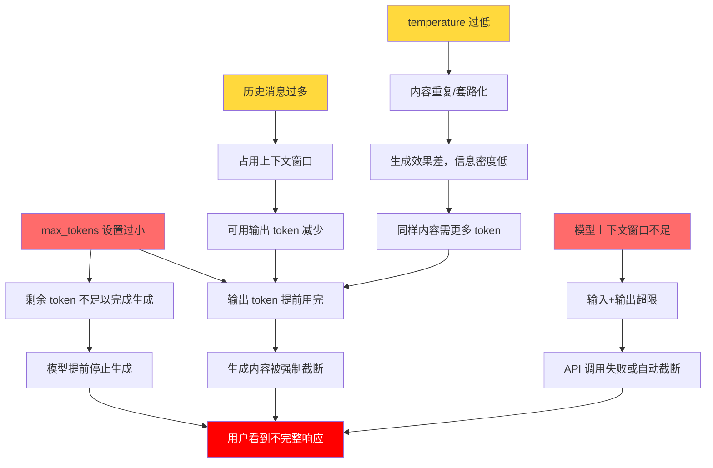
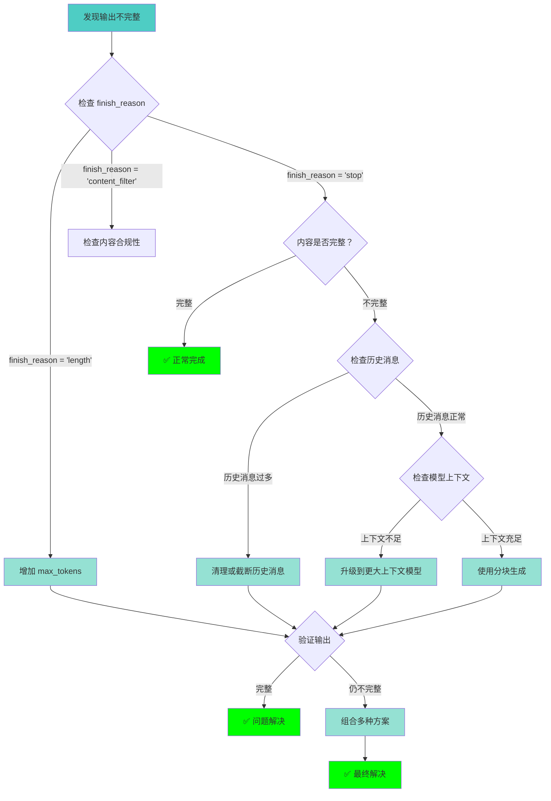
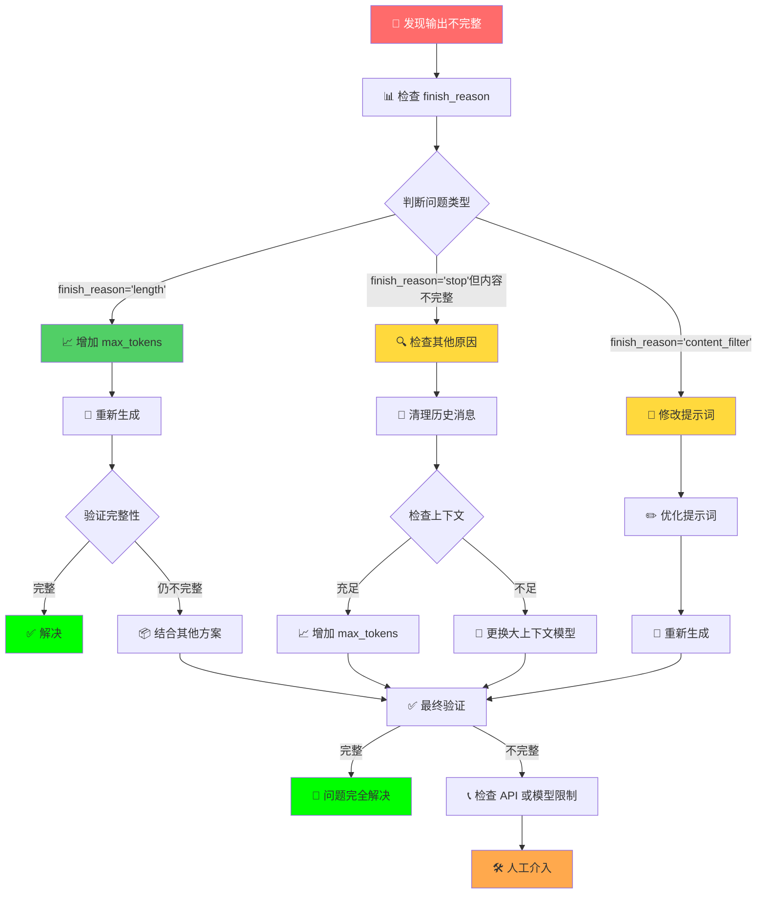
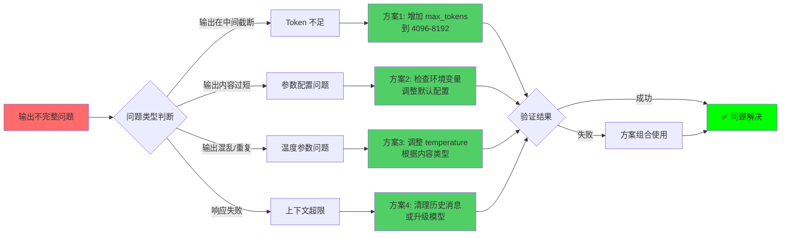

# LangChain Agent 输出不完整问题完整解决方案

---

## 📌 一、问题现象

在使用 LangChain 的 `create_agent` 调用大模型时，输出被截断、不完整：
- 诗词只生成前半部分就中断
- 响应内容在中间突然截止
- 长文本生成时出现"断尾"

---

## 🔍 二、根本原因

### 核心原因：Token 限制参数配置不当

大语言模型受 **`max_tokens`** 参数限制，当生成内容达到该限制时强制停止，导致输出不完整。

---

## 📊 三、关键参数详解

### 1. `max_tokens`（最大令牌数）

| 属性 | 说明 |
|------|------|
| **作用** | 限制模型生成的最大 token 数量（输入+输出总 token 数） |
| **默认值** | 512-2048（因模型而异） |
| **范围** | 1 ~ 模型上下文窗口大小 |
| **影响** | **直接影响输出长度** ⭐⭐⭐⭐⭐ |

**后果：**
- 设置过小 → 输出被截断、不完整
- 设置过大 → API 费用增加、响应时间变长
- 超过模型限制 → API 调用失败

### 2. `temperature`（温度）

| 属性 | 说明 |
|------|------|
| **作用** | 控制生成内容的随机性和创造性 |
| **默认值** | 0.7 |
| **范围** | 0.0 ~ 2.0 |
| **影响** | 影响内容风格和质量，间接影响 token 消耗 |

**后果：**
- 过低（0.0-0.3）→ 内容重复、机械化，可能提前终止
- 过高（1.5-2.0）→ 内容混乱、逻辑不连贯，token 浪费

### 3. `max_completion_tokens`（部分 API 专用）

| 属性 | 说明 |
|------|------|
| **作用** | 仅限制输出 token 数量（不含输入） |
| **注意** | OpenAI 部分新模型使用此参数替代 `max_tokens` |
| **影响** | 更精确控制输出长度 |

**后果：** 与 `max_tokens` 混淆会导致参数不生效或冲突

### 4. 模型上下文窗口（Context Window）

| 属性 | 说明 |
|------|------|
| **作用** | 模型单次处理的最大 token 总数（输入+输出） |
| **示例** | GPT-4: 8192/32768, Qwen: 8192/32768 |
| **影响** | 超限会截断历史消息或拒绝请求 |

**后果：**
- 历史消息累积过多 → 可用输出 token 减少
- 输入+输出 > 上下文窗口 → 抛出错误或自动截断

---

## ⚠️ 四、参数问题导致的连锁反应

### 问题清单

| 问题 | 表现 | 严重程度 |
|------|------|----------|
| 输出中断 | 内容在中间截断 | ⭐⭐⭐⭐⭐ |
| 响应过短 | 生成内容简略、不完整 | ⭐⭐⭐⭐ |
| API 调用失败 | 超过上下文窗口限制 | ⭐⭐⭐⭐⭐ |
| 内容质量差 | 重复、无意义内容 | ⭐⭐⭐ |
| 响应超时 | token 过多导致生成慢 | ⭐⭐⭐ |
| 成本增加 | 每个请求 token 消耗大 | ⭐⭐⭐⭐ |

### 连锁反应流程图



---

## 🛠️ 五、完整解决方案

### 方案 1：增加 `max_tokens` 参数（最常用）⭐

```python
from langchain_openai import ChatOpenAI

model = ChatOpenAI(
    model="qwen3.5-plus",
    max_tokens=4096,  # 从默认 2000 增加到 4096
    temperature=0.7,
)
```

**适用场景：** 需要生成长文本（文章、诗词、代码）

### 方案 2：使用环境变量动态配置

```python
import os

model = ChatOpenAI(
    model=os.environ.get("OPENAI_MODEL", "qwen3.5-plus"),
    max_tokens=int(os.environ.get("OPENAI_MAX_TOKENS", "4096")),  # 提高默认值
)
```

**.env 文件配置：**
```env
OPENAI_MAX_TOKENS=8192
OPENAI_MODEL=qwen3.5-plus
OPENAI_TEMPERATURE=0.7
```

### 方案 3：分块生成（处理超长内容）

```python
def generate_long_text(prompt, chunk_size=2000):
    """分块生成长文本"""
    results = []
    for i in range(3):  # 分3块生成
        chunk_prompt = f"{prompt}\n\n请生成第{i+1}部分内容："
        response = model.invoke(chunk_prompt)
        results.append(response.content)
    return "\n".join(results)
```

**适用场景：** 生成超长内容（小说、报告）

### 方案 4：使用流式输出监控进度

```python
# 使用 stream 模式查看生成进度
for chunk in model.stream(prompt):
    print(chunk.content, end="", flush=True)  # 实时查看输出
```

### 方案 5：清理历史消息释放空间

```python
from langchain_core.messages import HumanMessage

# 限制历史消息数量
def trim_history(messages, max_history=5):
    """只保留最近 N 条消息"""
    if len(messages) > max_history:
        return messages[-max_history:]
    return messages

# 或者在 invoke 时控制
result = agent.invoke(
    {
        "messages": [HumanMessage(content=prompt)],
        # 不传递完整历史，只传当前消息
    },
    config=config
)
```

### 方案 6：验证输出完整性

```python
def validate_completion(content, expected_length=200):
    """验证输出是否完整"""
    if len(content) < expected_length:
        print(f"⚠️ 警告：输出可能不完整（长度：{len(content)}）")
        return False
    return True

# 使用
response = model.invoke(prompt)
if not validate_completion(response.content, 500):
    # 重新生成或提示用户
    print("内容不完整，正在重新生成...")
    response = model.invoke(prompt + "请确保完整输出")
```

### 方案 7：检查 finish_reason 诊断问题

```python
# 检查 API 响应完成原因
response = model.invoke(prompt)
finish_reason = response.response_metadata.get('finish_reason', '未知')

if finish_reason == 'length':
    print("⚠️ 输出因达到 max_tokens 限制而被截断")
    print("建议：增加 max_tokens 参数")
elif finish_reason == 'stop':
    print("✅ 输出正常完成")
else:
    print(f"完成原因: {finish_reason}")
```

### 方案 8：选择合适的模型

```python
# 长文本生成选择大上下文模型
models_for_long_text = {
    "qwen3.5-plus": 32768,    # 32K 上下文
    "qwen3.5-72b": 32768,
    "gpt-4-turbo": 128000,   # 128K 上下文
    "claude-3-opus": 200000, # 200K 上下文
}

# 根据内容长度选择模型
def select_model(content_length):
    if content_length > 10000:
        return "gpt-4-turbo"  # 大上下文
    return "qwen3.5-plus"    # 标准
```

---

## 📋 六、参数配置建议表

| 内容类型 | 建议 max_tokens | 建议 temperature | 说明 |
|---------|----------------|------------------|------|
| 短问答 | 1024-2048 | 0.5-0.7 | 日常对话 |
| 文章写作 | 4096-8192 | 0.7-0.9 | 需要创造性的内容 |
| 诗词创作 | 2048-4096 | 0.8-1.0 | 需要文学性 |
| 代码生成 | 4096-8192 | 0.2-0.4 | 需要准确性 |
| 长文档总结 | 8192+ | 0.3-0.5 | 需要完整性 |
| 翻译任务 | 2048-4096 | 0.3-0.5 | 需要准确性 |

---

## 🔄 七、问题诊断与解决流程图

### 问题诊断决策流程图



### 完整诊断与解决流程



### 解决方案选择流程图



---

## 💻 八、完整代码示例

```python
from langchain.agents import create_agent
from langchain_openai import ChatOpenAI
from langgraph.checkpoint.memory import InMemorySaver
from langchain_core.messages import HumanMessage, AIMessage
from dotenv import load_dotenv
import os

load_dotenv()

# 1. 配置模型（增加 max_tokens）
model = ChatOpenAI(
    model=os.environ.get("OPENAI_MODEL", "qwen3.5-plus"),
    base_url=os.environ.get("OPENAI_BASE_URL"),
    api_key=os.environ.get("OPENAI_API_KEY"),
    temperature=float(os.environ.get("OPENAI_TEMPERATURE", "0.7")),
    max_tokens=int(os.environ.get("OPENAI_MAX_TOKENS", "4096")),  # 关键修改
)

# 2. 创建 Agent
checkPointer = InMemorySaver()
agent = create_agent(
    model=model,
    checkpointer=checkPointer
)

# 3. 验证输出完整性函数
def validate_and_print_response(result):
    """验证并打印响应"""
    for msg in result["messages"]:
        if isinstance(msg, AIMessage) and msg.content:
            content = msg.content
            print(f"内容长度: {len(content)} 字符")
            print("-" * 50)
            print(content)
            print("-" * 50)
            
            # 检查 finish_reason
            if hasattr(msg, 'response_metadata'):
                finish_reason = msg.response_metadata.get('finish_reason', '未知')
                if finish_reason == 'length':
                    print("⚠️ 警告：输出被截断，请增加 max_tokens")
                elif finish_reason == 'stop':
                    print("✅ 输出完整")
            return content
    return None

# 4. 执行对话
config = {"configurable": {"thread_id": "1"}}

print("============第一轮============")
result = agent.invoke(
    {
        "messages": [HumanMessage(content="请创作一首完整的七言律诗作为送别词")]
    },
    config=config
)
validate_and_print_response(result)

print("\n============第二轮============")
result = agent.invoke(
    {
        "messages": [HumanMessage(content="再来一首，要豪迈风格")]
    },
    config=config
)
validate_and_print_response(result)
```

---

## ✅ 九、推荐检查清单

- [ ] `max_tokens` 是否设置为预期输出长度的 1.5-2 倍？
- [ ] 历史消息是否占用过多上下文窗口？
- [ ] 模型是否支持所需的上下文长度？
- [ ] API 调用是否返回了截断标志（finish_reason）？
- [ ] 是否使用了流式输出监控生成进度？
- [ ] 输出长度是否进行了验证检查？
- [ ] 是否考虑使用分块生成处理超长内容？

---

## 🎯 十、快速修复

```python
# 最简单的修复方法 - 直接增加 max_tokens
model = ChatOpenAI(
    model="your-model",
    max_tokens=8192,  # 从 2000 改为 8192
)
```

---

## 📊 十一、监控指标

| finish_reason | 含义 | 处理方式 |
|--------------|------|----------|
| `'length'` | 达到 max_tokens 限制 | ✅ 增加 max_tokens |
| `'stop'` | 正常完成 | ✅ 无需处理 |
| `'content_filter'` | 内容被过滤 | ⚠️ 检查内容合规性 |

---

## 📌 十二、总结

| 问题 | 解决方案 | 优先级 |
|------|---------|--------|
| max_tokens 过小 | 增大到 4096-8192 | 🔴 立即 |
| 历史消息过多 | 清理或截断历史 | 🟡 重要 |
| 模型上下文不足 | 升级到更大上下文模型 | 🟡 重要 |
| 内容验证缺失 | 添加完整性检查 | 🟢 建议 |
| 无监控机制 | 使用流式输出 | 🟢 建议 |

### 🎯 核心要点

> **输出不完整 90% 以上的情况都是 `max_tokens` 设置过小导致的，优先调整该参数即可解决问题。**

### 📖 流程图说明

| 流程图名称 | 用途 |
|-----------|------|
| **连锁反应流程图** | 展示参数问题的因果链 |
| **问题诊断决策流程图** | 指导问题排查路径 |
| **解决方案选择流程图** | 根据问题类型选方案 |
| **完整诊断流程** | 端到端问题解决 |

---

> **💡 提示：** 以上所有代码示例均可直接复制使用，根据实际需求调整参数值即可。流程图可在支持 Mermaid 的编辑器中渲染显示。