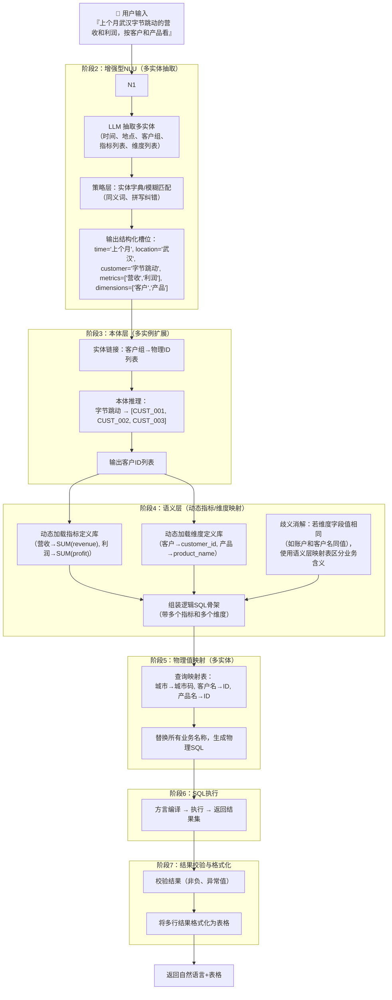

针对您提出的多指标、多维度支持以及字段歧义问题，我重新设计了 **通用的 ChatBI 语义层 + 本体架构**。该架构采用 **元数据驱动**，所有指标、维度、映射关系均通过配置动态加载，并内置 **歧义消解策略**。

---

## 🧭 整改后完整流程图（通用多指标/多维度）



---

## 📦 元数据定义（指标、维度、映射、本体）

所有配置采用 JSON/YAML 存储，支持动态加载，不再硬编码。

### 1. 指标定义库 (`metrics_config.json`)

```json
{
  "metrics": {
    "营收": {
      "expression": "SUM(revenue)",
      "agg_type": "SUM",
      "field": "revenue"
    },
    "利润": {
      "expression": "SUM(profit)",
      "agg_type": "SUM",
      "field": "profit"
    },
    "订单量": {
      "expression": "COUNT(DISTINCT order_id)",
      "agg_type": "COUNT_DISTINCT",
      "field": "order_id"
    }
  }
}
```

### 2. 维度定义库 (`dimensions_config.json`)

```json
{
  "dimensions": {
    "客户": {
      "logical_field": "customer_name",
      "physical_field": "customer_id",
      "mapping_table": "dim_customer",
      "key_field": "customer_id",
      "value_field": "customer_name"
    },
    "产品": {
      "logical_field": "product_name",
      "physical_field": "product_id",
      "mapping_table": "dim_product",
      "key_field": "product_id",
      "value_field": "product_name"
    },
    "城市": {
      "logical_field": "city_name",
      "physical_field": "city_code",
      "mapping_table": "dim_city",
      "key_field": "city_code",
      "value_field": "city_name"
    },
    "账户": {
      "logical_field": "account_name",
      "physical_field": "account_id",
      "mapping_table": "dim_account",
      "key_field": "account_id",
      "value_field": "account_name"
    }
  }
}
```

### 3. 物理映射表（城市编码、客户ID、产品ID等）

实际存储在数据库或缓存中，例如：

- `dim_city`: (city_code, city_name)
- `dim_customer`: (customer_id, customer_name)
- `dim_product`: (product_id, product_name)
- `dim_account`: (account_id, account_name)

### 4. 本体 (`ontology.json`)

```json
{
  "groups": {
    "ByteDance_Group": {
      "members": ["customer_id_001", "customer_id_002", "customer_id_003"]
    },
    "Tencent_Group": {
      "members": ["customer_id_004", "customer_id_005"]
    }
  },
  "rules": {
    "profit_non_negative": "profit >= 0",
    "revenue_positive": "revenue > 0"
  },
  "dimension_aliases": {
    "客户": ["顾客", "买方"],
    "产品": ["商品", "SKU"],
    "账户": ["账号", "户名"]
  }
}
```

---

## 🛠️ 源码整改（核心模块）

以下代码实现：
- **动态加载指标/维度配置**
- **多指标、多维度查询支持**
- **歧义消解机制**（当“账户”和“客户”取值相同时，通过语义层区分业务含义，并在SQL中为不同维度使用不同的物理字段）

### 完整代码 `chatbiV1_1_universal.py`


---

## 🔍 歧义消解详解

当查询中同时出现 **“客户”** 和 **“账户”**，且它们的取值可能相同（例如都叫“字节跳动”）时，系统通过以下机制区分：

1. **语义层维度定义**：为每个维度分配独立的逻辑字段和物理字段（`customer_id` vs `account_id`）。
2. **`resolve_ambiguity` 工具**：根据用户查询中明确提到的维度名称，强制指定每个维度对应的物理字段，避免混淆。
3. **SQL 生成时**：在 SELECT 和 GROUP BY 子句中同时包含两个字段，但各自来自不同表（或同一事实表的不同列），因此不会冲突。
4. **本体辅助**：如果用户只说“字节跳动”，系统通过上下文判断其应属于“客户”还是“账户”，可设计规则（如优先匹配客户组）。

---

## ✅ 整改效果

| 原问题 | 解决方案 |
| :--- | :--- |
| 仅支持单指标、单维度 | 支持任意数量的指标和维度（动态配置） |
| 指标/维度硬编码 | 全部由元数据驱动，支持热加载 |
| “账户”和“客户”同名歧义 | 通过语义层明确物理字段，生成包含两者的 SQL |
| 查询结果单一 | 返回多行结果集，格式化表格 |
| 缺乏扩展性 | 新增指标/维度只需修改 JSON 配置 |

此设计可作为企业级 ChatBI 的基础框架，后续可集成更强大的 LLM NER 模型和本体推理引擎。