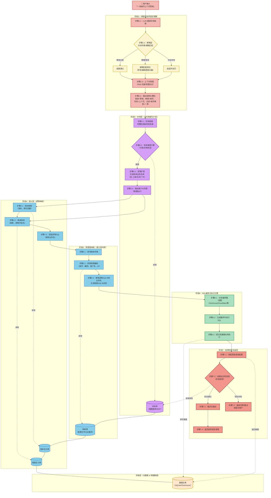

# ChatBI - 基于 Ontology 的智能商业智能问答系统

## 概述

ChatBI 是一个 **基于本体（Ontology）架构** 的智能商业智能问答 Agent，能够将用户的自然语言业务查询自动转换为数据库查询并返回结构化答案。

**核心能力：** 用户问 "一线城市上个月应收多少？" → Agent 自动理解 "一线城市" 概念 → 通过本体扩层得到 `[上海, 北京, 广州, 深圳]` → 生成并执行 SQL → 返回 "一线城市上个月应收约 1823.45 万元"。

## 架构设计

### 架构思想

ChatBI 采用 **7 阶段分层架构**，核心设计思想包括：

| 思想 | 说明 |
|------|------|
| **职责单一** | 每个阶段封装为独立工具，便于测试、替换和扩展 |
| **语义分离** | 本体层只处理逻辑推理（扩层），不触碰物理存储细节；语义层负责所有映射 |
| **策略层前置** | 在 NLU 阶段引入字典和模糊匹配，显著提升实体解析准确率 |
| **校验后置** | 利用本体规则进行最终把关，保障结果质量 |
| **存储解耦** | 映射表、本体库、指标定义均可独立维护，支持热更新 |
| **B+D 混合策略** | 先查数据库（Business rules），未命中则 LLM 推理（Data-driven），兼顾准确性和覆盖率 |
| **学习模式** | LLM 推理结果可回写数据库，系统越用越智能 |

### 架构分层

```
┌─────────────────────────────────────────────────────────────────────┐
│                        用户输入层                                    │
│              "一线城市上个月应收多少？"                                │
└───────────────────────┬─────────────────────────────────────────────┘
                        │
┌───────────────────────▼─────────────────────────────────────────────┐
│  阶段2：增强型 NLU（自然语言理解）                                     │
│  ┌─────────────┐  ┌──────────────┐  ┌───────────────┐              │
│  │ 2.1 LLM实体 │→│ 2.2 策略层     │  │ 2.3 RAG增强   │              │
│  │    抽取      │  │ 字典/模糊匹配 │  │  上下文增强    │              │
│  └─────────────┘  └──────────────┘  └───────────────┘              │
│  依赖：实体字典（ENTITY_DICT）                                        │
└───────────────────────┬─────────────────────────────────────────────┘
                        │ 结构化槽位
                        │ {concept:"一线城市", metric:"应收", time:"上个月"}
┌───────────────────────▼─────────────────────────────────────────────┐
│  阶段3：本体层（业务推理与扩层）                                       │
│  ┌─────────────┐  ┌──────────────┐  ┌───────────────┐              │
│  │ 3.1 实体链接 │→│ 3.2 本体推理  │→│ 3.3 逻辑扩层   │              │
│  │ 槽位→本体类  │  │ 子类/实例查询 │  │ 生成具体名单   │              │
│  └─────────────┘  └──────────────┘  └───────┬───────┘              │
│                    依赖：本体库               │ 学习模式（可选）      │
└───────────────────────┬─────────────────────┘                     │
                        │ 客户ID列表                                 │
                        │ ["CUST_SH_001", "CUST_BJ_002", ...]        │
┌───────────────────────▼─────────────────────────────────────────────┐
│  阶段4：语义层（逻辑映射）                                            │
│  ┌─────────────┐  ┌──────────────┐  ┌───────────────┐              │
│  │ 4.1 指标映射 │  │ 4.2 维度映射 │  │ 4.3 逻辑SQL   │              │
│  │ 应收→SUM()   │  │ 城市→city_   │  │   组装         │              │
│  │             │  │     name      │  │               │              │
│  └─────────────┘  └──────────────┘  └───────────────┘              │
│  依赖：指标定义库、维度定义库                                         │
└───────────────────────┬─────────────────────────────────────────────┘
                        │ 逻辑SQL（含业务名称）
┌───────────────────────▼─────────────────────────────────────────────┐
│  阶段5：物理值映射                                                   │
│  ┌─────────────┐  ┌──────────────┐                                  │
│  │ 5.1 查询映射 │→│ 5.2 替换为    │                                  │
│  │    字典      │  │   物理编码    │                                  │
│  └─────────────┘  └──────────────┘                                  │
│  依赖：映射表（CITY_CODE_MAP, ENTITY_TO_ID）                          │
└───────────────────────┬─────────────────────────────────────────────┘
                        │ 物理SQL（含物理编码）
┌───────────────────────▼─────────────────────────────────────────────┐
│  阶段6：SQL编译与执行引擎                                            │
│  ┌─────────────┐  ┌──────────────┐  ┌───────────────┐              │
│  │ 6.1 方言适配 │→│ 6.2 生成可    │→│ 6.3 提交至     │              │
│  │ (ClickHouse │  │   执行SQL     │  │   数据仓库执行  │              │
│  │  /Snowflake)│  │               │  │               │              │
│  └─────────────┘  └──────────────┘  └───────────────┘              │
│  依赖：数据仓库（SQLite/ClickHouse/...）                              │
└───────────────────────┬─────────────────────────────────────────────┘
                        │ 原始数值
┌───────────────────────▼─────────────────────────────────────────────┐
│  阶段7：结果校验与返回                                               │
│  ┌─────────────┐  ┌──────────────┐  ┌───────────────┐              │
│  │ 7.1 获取结果 │→│ 7.2 自洽性    │→│ 7.3 格式化     │              │
│  │             │  │    校验        │  │   返回答案      │              │
│  └─────────────┘  └──────────────┘  └───────────────┘              │
│  依赖：本体规则库                                                     │
└─────────────────────────────────────────────────────────────────────┘
```

### 存储层

```
┌──────────────────────────────────────────────────────────────┐
│                        存储层                                  │
│                                                              │
│  ┌──────────────┐  ┌──────────────┐  ┌──────────────┐       │
│  │  本体库       │  │  映射表       │  │  指标定义库   │       │
│  │ (SQLite图结构)│  │ (配置/DB/缓存)│  │              │       │
│  │ ontology_    │  │ CITY_CODE_   │  │              │       │
│  │ nodes/edges  │  │ MAP          │  │              │       │
│  └──────────────┘  └──────────────┘  └──────────────┘       │
│                                                              │
│  ┌──────────────┐  ┌──────────────┐                         │
│  │  维度定义库   │  │  实体字典     │                         │
│  │              │  │ (ENTITY_DICT)│                         │
│  └──────────────┘  └──────────────┘                         │
│                                                              │
│  ┌──────────────────────────────────────────────────────┐   │
│  │              数据仓库（业务事实数据）                    │   │
│  │        fact_account_receivable                       │   │
│  └──────────────────────────────────────────────────────┘   │
└──────────────────────────────────────────────────────────────┘
```

### 核心架构图（Mermaid）



## 架构分层与职责总览

| 层级 | 模块 | 核心职责 | 输入 | 输出 | 关键存储依赖 |
| :--- | :--- | :--- | :--- | :--- | :--- |
| **用户层** | 用户输入 | 发起自然语言查询 | 文本问题 | 原始查询字符串 | — |
| **增强型 NLU** | 实体抽取 + 策略修正 | 提取结构化槽位，利用字典/模糊匹配纠偏，RAG 增强 | 文本 | 实体（时间、地点、客户、指标） | 实体字典 |
| **本体层** | 实体链接 + 推理引擎 | 将概念链接到本体，推理子类/实例，扩展为具体物理 ID 列表 | 槽位 | 客户 ID 列表 | 本体库（图结构） |
| **语义层（逻辑）** | 指标/维度映射 + 逻辑SQL组装 | 将业务指标和维度映射为逻辑表达式和字段名，生成带业务名的 SQL | 实体 + 客户ID | 逻辑 SQL（含业务名） | 指标定义库、维度定义库 |
| **语义层（物理）** | 物理值映射 | 将逻辑 SQL 中的业务名替换为物理编码（城市码、客户ID、字段名） | 逻辑 SQL | 物理 SQL（含编码） | 映射表（配置文件/DB/缓存） |
| **执行引擎** | SQL 编译 + 方言适配 + 提交执行 | 将 SQL 转换为目标数据库方言并执行 | 物理 SQL | 原始结果（数值） | 数据仓库 |
| **校验与返回** | 结果自洽性校验 + 格式化 | 利用本体规则检查结果是否合理，格式化后返回 | 原始结果 | 自然语言答案 | 本体库（规则） |

## 完整数据流

1. **用户输入** `"一线城市上个月应收多少"`。
2. **NLU** 抽取出 `{时间=上个月, 概念=一线城市, 指标=应收}`，并经过 **策略修正**（别名标准化："一线城市" → "tier1_cities"）。
3. **本体层** 将"一线城市"链接到本体中的类，通过 **递归 CTE** 推理出**实例列表**（上海、北京、广州、深圳），再转换为对应的**物理城市编码列表**（`['021','010','020','0755']`）。
4. **逻辑映射** 将"应收"映射为 `SUM(balance)`，将"城市"映射为逻辑字段 `city_name`，组装成**逻辑 SQL**。
5. **物理映射** 将业务名称替换为物理编码，生成**物理 SQL**：`SELECT SUM(balance) ... WHERE city_code IN ('021','010','020','0755')`。
6. **执行引擎** 提交给数据仓库（SQLite/ClickHouse），返回数值。
7. **校验层** 检查数值是否合理（如应收款 ≥ 0），通过则格式化返回；否则告警。

## 核心模块

### ChatBiAgentV1.py — 基础版本

基于硬编码本体字典的 ChatBI Agent，使用内存字典实现基础的本体扩层功能。适合作为入门参考。

### ChatBiAgentOntology.py — 本体增强版本

集成了 **ontology 模块** 的 ChatBI Agent，支持：
- 基于 SQLite 递归 CTE 的本体图结构
- 多类型概念扩层（城市/客户/区域）
- 混合策略（数据库查询 + LLM 推理兜底）
- 可选学习模式（LLM 推理结果回写数据库）

### ontology/ — 本体逻辑扩层模块

独立的本体扩层库，可复用于任意 Text-to-SQL 场景。

| 组件 | 说明 |
|------|------|
| `OntologyQueryEngine` | 数据库查询引擎，基于递归 CTE 实现多级扩层查询 |
| `OntologyLLMReasoner` | LLM 推理引擎，数据库未命中时的兜底策略 |
| `OntologyExpander` | 混合调度器，协调数据库查询和 LLM 推理 |
| `ConceptNameNormalizer` | 概念名称标准化器，处理别名映射和模糊匹配 |
| `logical_layer_expansion` | LangChain Tool，对外暴露扩层能力 |

详细文档参见 [ontology/README.md](ontology/README.md)。

## 本体数据模型

### ontology_nodes（本体节点表）

| 字段 | 类型 | 说明 |
|------|------|------|
| id | INTEGER PK | 自增主键 |
| node_name | TEXT UNIQUE | 节点唯一标识名 |
| node_type | TEXT | `abstract_concept` / `concrete_instance` |
| concept_category | TEXT | `city` / `customer` / `region` / `business` |
| display_name | TEXT | 显示名称 |
| attributes | TEXT (JSON) | 扩展属性（如 `{"code": "021"}`） |

### ontology_edges（本体关系表）

| 字段 | 类型 | 说明 |
|------|------|------|
| parent_id | INTEGER FK | 父节点 ID |
| child_id | INTEGER FK | 子节点 ID |
| relation_type | TEXT | 关系类型（如 `includes`） |
| edge_weight | REAL | 关系权重（默认 1.0） |

### 示例数据关系

```
                    tier1_cities (一线城市)
                    ┌──────────────┐
                    │              │
                    ▼              ▼
            shanghai ──── beijing ──── guangzhou ──── shenzhen
            (上海/021)   (北京/010)     (广州/020)      (深圳/0755)

                    bytedance_group (字节跳动集团)
                    ┌──────────────┐
                    │              │
                    ▼              ▼
            wuhan_subsidiaries (武汉子公司)
                    │
            ┌───────┼───────┐
            ▼       ▼       ▼
         toutiao  douyin  feishu

                    east_china (华东区)
                    ┌──────────────┐
                    │              │
                    ▼              ▼
            shanghai ──── hangzhou ──── nanjing ──── suzhou
```

## 快速开始

### 环境要求

- Python >= 3.12
- SQLite >= 3.35（支持递归 CTE）
- OpenAI 兼容的 LLM API

### 安装依赖

```bash
pip install langchain langchain-openai python-dotenv deepagents
```

### 运行

```bash
# 设置环境变量
export OPENAI_API_KEY="sk-xxx"
export OPENAI_BASE_URL="https://api.openai.com/v1"
export OPENAI_MODEL="qwen3.5-plus"

# 运行本体增强版本
python ChatBiAgentOntology.py
```

### 测试查询

```python
from ChatBiAgentOntology import test_ask_question

# 测试城市扩层查询
test_ask_question("一线城市上个月应收多少")

# 测试区域扩层查询
test_ask_question("华东区本月营收如何")
```

## 使用 Ontology 模块

### 独立使用

```python
from ontology import OntologyExpander

expander = OntologyExpander("chatbi.db")

# 扩层查询
cities = expander.expand("tier1_cities", "city")
print(cities)  # ['shanghai', 'beijing', 'guangzhou', 'shenzhen']

# 使用别名
cities = expander.expand("一线城市", "city")
print(cities)  # 同上

# 返回映射字典
mapping = expander.expand("一线城市", "city", return_type="both")
print(mapping)  # {'shanghai': '021', 'beijing': '010', ...}
```

### 启用学习模式

```python
expander = OntologyExpander(
    db_path="chatbi.db",
    model=your_llm,
    enable_llm_reasoning=True,
    enable_learning_mode=True  # LLM 推理结果自动回写
)

# 查询一个数据库中不存在的概念
result = expander.expand("粤港澳大湾区", "city")
# LLM 推理出实例，并自动写入 ontology_nodes 和 ontology_edges
```

### 使用 Protege 构建本体

支持通过 Protege-5.6.9 可视化工具设计本体，然后转换为 SQLite 格式。

详细步骤参见：[1.2.ChatBiAgentOntology本体设计.md](1.2.ChatBiAgentOntology本体设计.md)

## 架构文档索引

| 文档 | 说明 |
|------|------|
| [chatbi.md](chatbi.md) | 完整 7 阶段架构设计、Mermaid 流程图、分层职责总览 |
| [1.2.ChatBiAgentOntology本体设计.md](1.2.ChatBiAgentOntology本体设计.md) | Ontology 作用、架构设计、运行流程图、构建流程、Protege 使用指南 |
| [ontology/README.md](ontology/README.md) | 本体扩层模块详细 API 文档、数据模型、配置说明、故障排查 |

## 关键设计要点

- **职责单一**：每个阶段独立工具，便于测试、替换和扩展
- **策略层前置**：在 NLU 阶段引入字典和模糊匹配，显著提升实体解析准确率
- **本体与语义层分离**：本体只处理逻辑推理（扩层），不触碰物理存储细节；语义层负责所有映射
- **校验后置**：利用本体规则进行最终把关，保障结果质量
- **存储解耦**：映射表、本体库、指标定义均可独立维护，支持热更新
