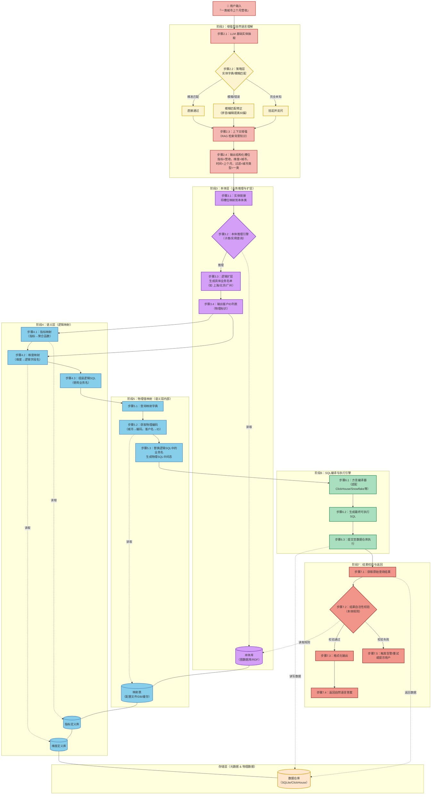

以下是基于我们之前讨论的 **7 阶段架构** 设计的 **完整 ChatBI 系统流程图与架构图**。它清晰展示了数据流、控制流、各层模块职责，以及关键存储组件（实体字典、本体库、映射表）的位置。

---

### 源码文件

### 🧭 完整架构流程图（含存储层）

---

### 📐 架构分层与职责总览

| 层级 | 模块 | 核心职责 | 输入 | 输出 | 关键存储依赖 |
| :--- | :--- | :--- | :--- | :--- | :--- |
| **用户层** | 用户输入 | 发起自然语言查询 | 文本问题 | 原始查询字符串 | — |
| **增强型 NLU** | 实体抽取 + 策略修正 | 提取结构化槽位，利用字典/模糊匹配纠偏，RAG 增强 | 文本 | 实体（时间、地点、客户、指标） | 实体字典 |
| **本体层** | 实体链接 + 推理引擎 | 将概念链接到本体，推理子类/实例，扩展为具体物理 ID 列表 | 槽位 | 客户 ID 列表 | 本体库（图结构） |
| **语义层（逻辑）** | 指标/维度映射 + 逻辑SQL组装 | 将业务指标和维度映射为逻辑表达式和字段名，生成带业务名的 SQL | 实体 + 客户ID | 逻辑 SQL（含业务名） | 指标定义库、维度定义库 |
| **语义层（物理）** | 物理值映射 | 将逻辑 SQL 中的业务名替换为物理编码（城市码、客户ID、字段名） | 逻辑 SQL | 物理 SQL（含编码） | 映射表（配置文件/DB/缓存） |
| **执行引擎** | SQL 编译 + 方言适配 + 提交执行 | 将 SQL 转换为目标数据库方言并执行 | 物理 SQL | 原始结果（数值） | 数据仓库 |
| **校验与返回** | 结果自洽性校验 + 格式化 | 利用本体规则检查结果是否合理，格式化后返回 | 原始结果 | 自然语言答案 | 本体库（规则） |

---

### 🔄 完整数据流（文字描述）

1. **用户输入** `"一类城市上个月营收"`。
2. **NLU** 抽取出 `{时间=上个月, 地点=一类城市, 指标=营收}`，并经过 **策略修正**（若“一类城市”未命中，模糊匹配到具体城市）。
3. **本体层** 将“一类城市”链接到本体中的类，推理出**实例列表**（如上海、北京、广州），再转换为对应的**物理客户 ID 列表**（例如 `['CUST_SH_001', 'CUST_BJ_002']`）。
4. **逻辑映射** 将“营收”映射为 `SUM(balance)`，将“城市”映射为逻辑字段 `city_name`，组装成**逻辑 SQL**：`SELECT SUM(balance) FROM fact WHERE customer_id IN (...) AND city_name = '一类城市' AND date BETWEEN ...`。
5. **物理映射** 将 `city_name = '一类城市'` 替换为 `city_code IN ('021','010','020')`，同时客户 ID 已为物理 ID，生成**物理 SQL**。
6. **执行引擎** 适配方言（如 ClickHouse）后提交给数据仓库，返回数值。
7. **校验层** 检查数值是否合理（如应收款 ≥ 0），通过则格式化返回；否则告警。

---

### 💎 关键设计要点

- **职责单一**：每个阶段独立工具，便于测试、替换和扩展。
- **策略层前置**：在 NLU 阶段引入字典和模糊匹配，显著提升实体解析准确率。
- **本体与语义层分离**：本体只处理逻辑推理（扩层），不触碰物理存储细节；语义层负责所有映射。
- **校验后置**：利用本体规则进行最终把关，保障结果质量。
- **存储解耦**：映射表、本体库、指标定义均可独立维护，支持热更新。

此架构可直接应用于生产级 ChatBI 系统，并可根据业务需求灵活扩展（如增加更多指标、维度、本体关系等）。