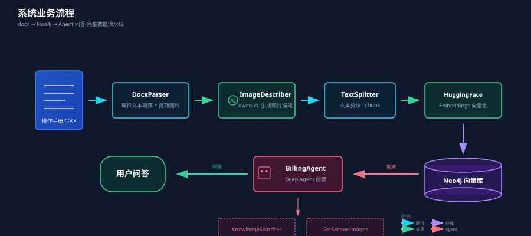
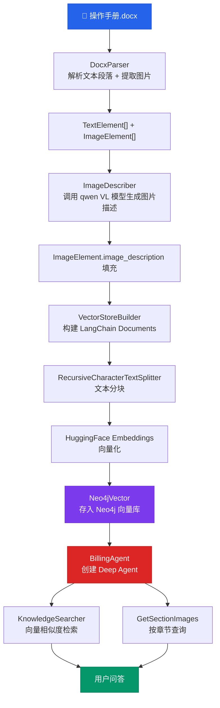
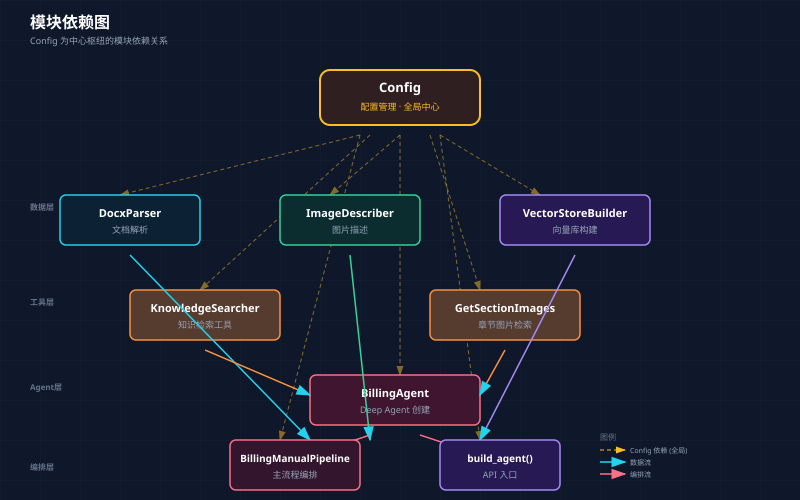
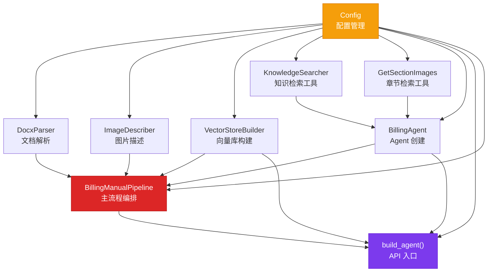
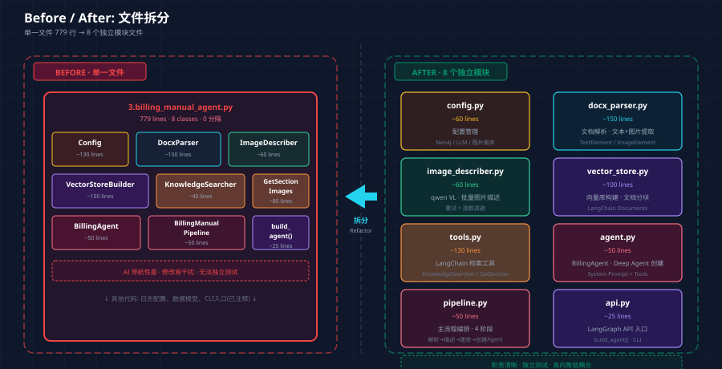
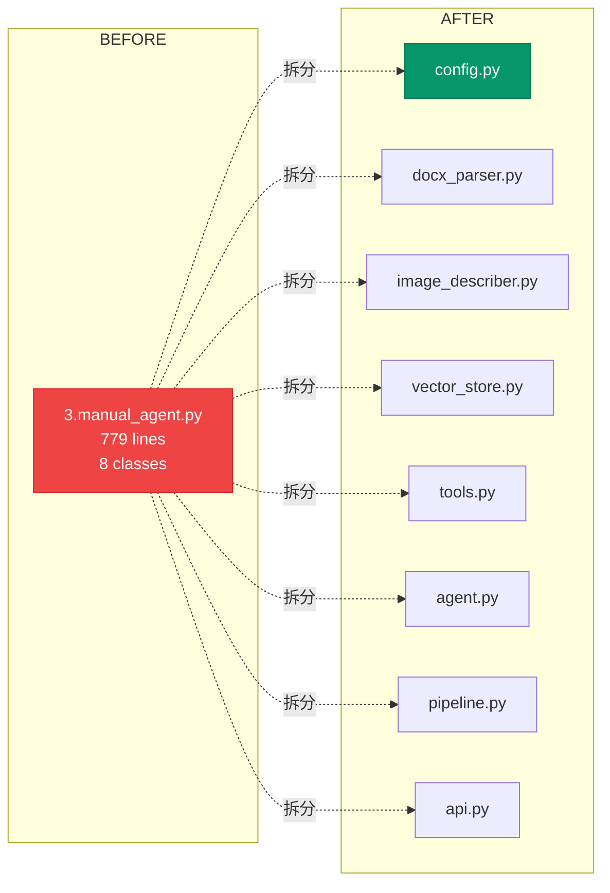
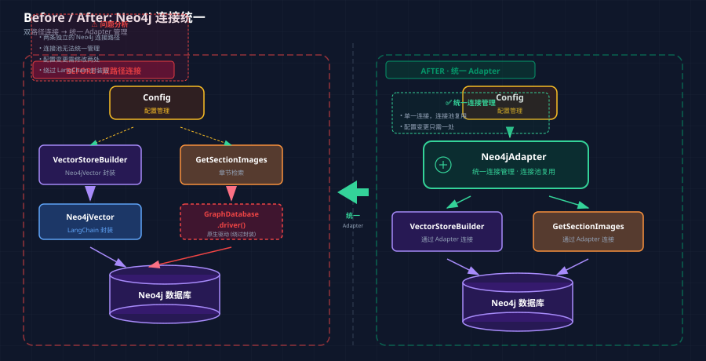
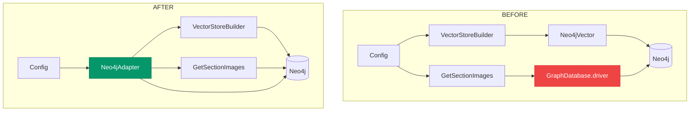

# Architecture Review — 操作手册 Agent

> 文件: `3.manual_agent.py`

---

## 完整业务流程

系统从 `.docx` 操作手册解析内容，生成图片描述，构建 Neo4j 向量库，最终通过 Deep Agent 提供问答检索服务。





---

## 当前模块依赖图





---

## 架构摩擦点候选

### 1. 单一文件承载所有模块 — 缺乏深度

**推荐强度: 🔴 Strong**

**Files:** `3.manual_agent.py`

**Problem:** 全文件 779 行，包含 Config、DocxParser、ImageDescriber、VectorStoreBuilder、KnowledgeSearcher、GetSectionImages、BillingAgent、BillingManualPipeline 共 8 个类 + API 入口 + CLI 入口（已注释）。所有模块挤在一个文件中，违背了低耦合高内聚原则。AI 助手在理解和修改某个模块时容易被其他代码干扰。模块的 interface 几乎和 implementation 一样复杂 — 这是典型的 **shallow module** 特征。

**Solution:** 拆分为独立模块文件，按 seam 划分:

| 文件 | 职责 |
|------|------|
| `config.py` | 配置管理 |
| `docx_parser.py` | 文档解析 |
| `image_describer.py` | 图片描述 |
| `vector_store.py` | 向量库构建与检索 |
| `tools.py` | LangChain 工具定义 |
| `agent.py` | Agent 创建 |
| `pipeline.py` | 主流程编排 |
| `api.py` | API 入口 |

**Benefits:**
- **Locality**: 修改文档解析只需看一个文件
- **Leverage**: 每个模块可独立测试、复用
- **AI 导航性**: Agent 在代码中搜索时更不容易被干扰
- 文件行数降到 100-200 行/个

**Before / After 对比:**



Before — 单文件 779 行:
```
3.manual_agent.py (779 lines, 8 classes)
├── Config
├── DocxParser
├── ImageDescriber
├── VectorStoreBuilder
├── KnowledgeSearcher
├── GetSectionImages
├── BillingAgent
└── Pipeline + API
```

After — 8 个独立模块文件:
```
config.py          (~60 lines)
docx_parser.py     (~150 lines)
image_describer.py (~60 lines)
vector_store.py    (~100 lines)
tools.py           (~130 lines)
agent.py           (~50 lines)
pipeline.py        (~50 lines)
api.py             (~25 lines)
```



---

### 2. GetSectionImages 重复创建 Neo4j 连接

**推荐强度: 🔴 Strong**

**Files:** `3.manual_agent.py:532-556`

**Problem:** `GetSectionImages._run()` 内部通过 `GraphDatabase.driver()` 创建全新的 Neo4j 连接，而不是复用 `VectorStoreBuilder` 已有的连接。同一个系统中存在两条连接 Neo4j 的路径：

- `VectorStoreBuilder` → `Neo4jVector`（LangChain 封装）
- `GetSectionImages` → `GraphDatabase.driver()`（原生驱动）

这导致连接池无法统一管理，配置变更需要同时修改两处，且原生驱动绕过了 LangChain 的封装层，丧失了统一的错误处理和重试机制。

**Solution:** 统一通过一个 **Neo4j Repository/Adapter** 管理所有数据库交互。VectorStoreBuilder 和 GetSectionImages 都依赖同一个接口，而不是各自直连。章节查询也可以通过 LangChain 的 Neo4jVector 底层 Graph 实例完成，不需要单独创建 driver。

**Benefits:**
- 单一连接管理，连接池复用
- 配置变更只需一处
- 统一的错误处理和超时控制
- 可测试性: mock 一个接口而非两个

**Before / After 对比:**



Before — 双路径连接:
```
Config → VectorStoreBuilder → Neo4jVector → Neo4j
Config → GetSectionImages   → GraphDatabase.driver() → Neo4j
```

After — 统一 Adapter:
```
Config → Neo4jAdapter → VectorStoreBuilder → Neo4j
                    → GetSectionImages     → Neo4j
```



---

### 3. Pipeline 中硬编码图片数量限制

**推荐强度: 🟡 Worth Exploring**

**Files:** `3.manual_agent.py:691`

**Problem:** `images = images[:3]` — 只保留前三张图片做描述，但整个文档实际有 58 张图片（img_0 ~ img_57）。这意味着向量库中大部分图片没有描述信息。这是一个临时性的 hack — 可能是因为 VL 模型调用成本高或超时。但硬编码在 pipeline 中，没有文档说明，后续维护者会困惑为何只有三张图有描述。

**Solution:** 将图片数量限制提升为配置项（`Config.describe_image_limit`），并在日志中明确记录跳过的图片数。如果限制是成本原因，应增加进度持久化，支持断点续传。

**Benefits:**
- 意图明确，不再困惑
- 可通过配置调整为 10/50/全部
- 配合断点续传减少重复调用成本

---

### 4. CLI 入口被注释 — 缺少独立运行能力

**推荐强度: 🟣 Speculative**

**Files:** `3.manual_agent.py:743-779`

**Problem:** `main()` 函数和 `if __name__ == "__main__"` 全部被注释掉。当前只能通过 `build_agent()` 作为 LangGraph API 工厂使用。无法直接通过命令行执行初始化/重建操作。开发调试时必须启动整个 API 服务，降低了迭代效率和 **locality**。

**Solution:** 取消注释 CLI 入口，或提取为独立的 `cli.py` 文件，支持 `python -m manual_agent init` 和 `rebuild` 命令。

**Benefits:**
- 开发时可独立测试 pipeline，无需启动服务
- 运维同学可直接通过 CLI 重建向量库
- 提高模块的独立可测性

---

## Top 推荐: 拆分文件 + 统一 Neo4j 连接

优先处理 **Candidate 1（文件拆分）**和 **Candidate 2（统一 Neo4j 连接）**。这两项改动会让后续所有变更都受益：

- 文件拆分后，每个模块可独立理解、测试和修改，提升 **locality**
- 统一 Neo4j 连接后，消除 duplicated connection logic，提升 **leverage**
- 拆分出的 `tools.py` 和 `vector_store.py` 可直接被项目中其他文件（如 `1.neo4j-langchain.py` 和 `2.neo4j-hfEmbdLangchain.py`）复用

> 这两个改动互相独立，可以先做文件拆分（机械性改动），再做连接统一（逻辑性改动）。
